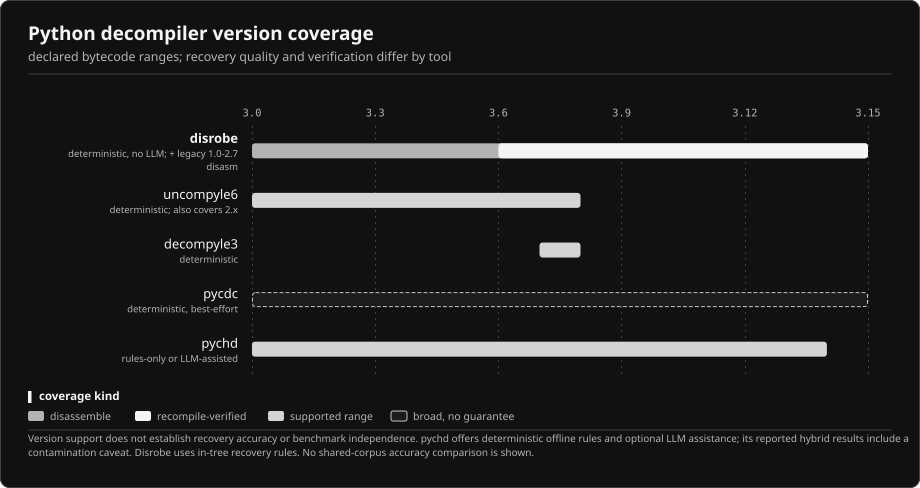
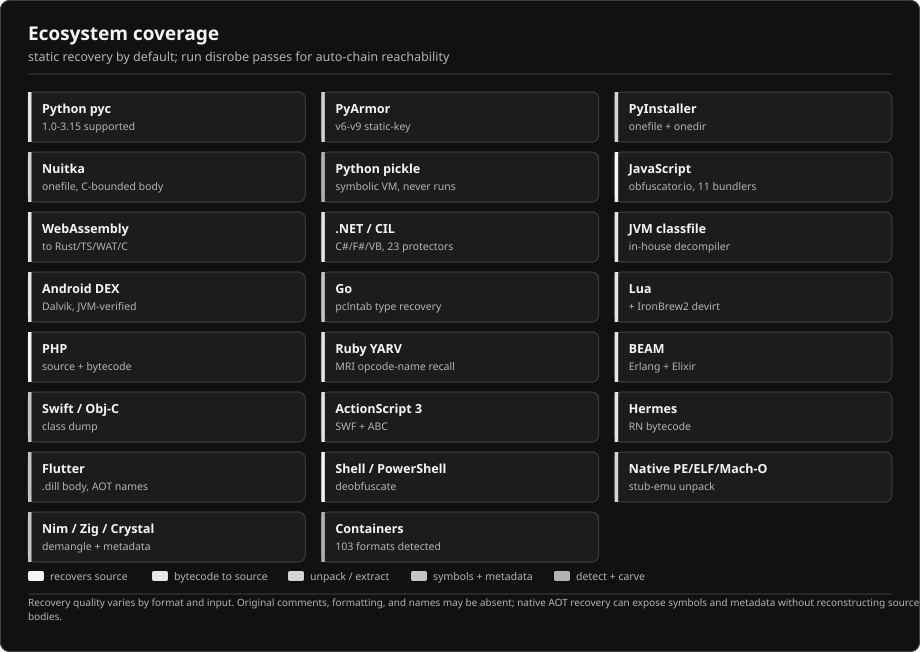
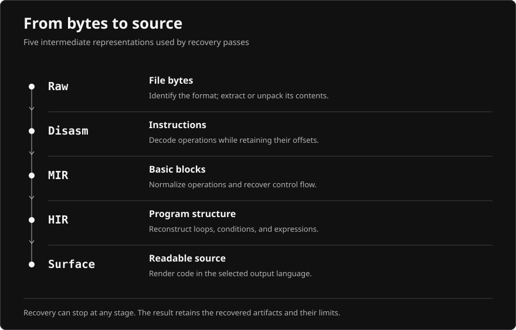
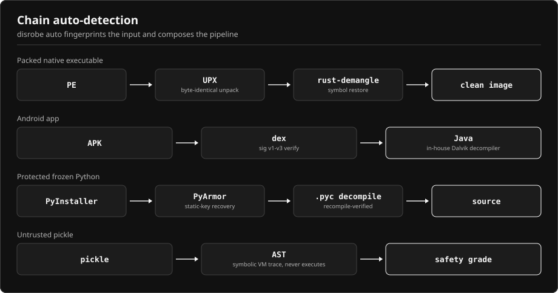

# `disrobe`


One static Rust binary that decompiles, deobfuscates, and unpacks software across 20+ ecosystems and proves what it recovered against an independent oracle. Deterministic, no execution of the sample, no model. Built for malware analysis, CTFs, IP recovery, and security research.

The differentiator is the pipeline, not any single pass: one deterministic chain runner carries every input end to end, and every recovered output is persisted as a content-addressed `.dr` envelope with its own provenance and oracle grade, so a result is never a bare score with no trail back to how it was produced.

[](https://github.com/1-3-7/disrobe/actions/workflows/ci.yml)
[](https://github.com/1-3-7/disrobe/releases)
[](LICENSE)
[](https://github.com/1-3-7/disrobe/releases)
[](https://1-3-7.github.io/disrobe/)

`disrobe` never executes the sample on its default path, runs no model, and installs no JVM, Python, or Docker runtime. Recovered Python is recompiled and diffed opcode-for-opcode in CI; unpacked bytes are byte-compared to the original; recovered Android, WebAssembly, and Lua are re-run through the real JVM verifier, wasmtime, and `lua`. Identical input yields identical output on every machine.

Try it in your browser: [`1-3-7.github.io/disrobe/playground`](https://1-3-7.github.io/disrobe/playground/). The analysis passes are compiled to WebAssembly and run client-side; nothing is uploaded.



## Table of contents

- [What this is / what this is not](#what-this-is--what-this-is-not)
- [Install](#install)
- [Quickstart](#quickstart)
- [Usage](#usage)
- [Capabilities by ecosystem](#capabilities-by-ecosystem)
- [Anti-analysis defeat](#anti-analysis-defeat)
- [Comparison](#comparison)
- [Benchmarks](#benchmarks)
- [Ecosystem maturity matrix](#ecosystem-maturity-matrix)
- [Architecture](#architecture)
- [Limits and honest walls](#limits-and-honest-walls)
- [Documentation](#documentation)
- [Safety posture](#safety-posture)
- [Legal](#legal)
- [Contributing](#contributing)
- [License](#license)
- [FAQ](#faq)




## What this is / what this is not

**Is:**

- A static, deterministic Rust binary that decompiles, deobfuscates, and unpacks across 20+ ecosystems, with identical input yielding byte-identical output on every machine, proven by a CI job that hashes the same real recovered fixtures on Linux, macOS, and Windows and fails if any two disagree.
- Graded per recovery against an independent oracle (a real compiler, verifier, interpreter, or execution differential), never against its own output.
- A CLI, a set of Rust library crates, Python bindings, and a daemon (`disrobe serve`, HTTP/gRPC/LSP/MCP), so the same passes drive automation and other tools.
- A recon and IOC engine (`frisk`, `prowl`, `indicators`) alongside decompilation, for secrets, endpoints, and threat-intel enrichment.
- Format-breadth-first: `disrobe identify`/`catalog` cover 20+ ecosystems, but the recovery depth per family ranges from full source recovery to detect-only; see [Capabilities by ecosystem](#capabilities-by-ecosystem) for the honest level per family.

**Is not:**

- Not a guaranteed full-recovery tool for every family: several catalog entries are Partial (structural peel or constants only, stated residual) or Detect-only (identification plus a stated absent-data reason).
- Not a virtualizing-protector devirtualizer for VMProtect, Themida, Enigma, and comparable runtime-keyed VMs: those are detect and carve only, see [Limits and honest walls](#limits-and-honest-walls).
- Not a sample-execution sandbox: the default path never runs the sample; the only two code-execution paths (the PyArmor v6/v7 dynamic hook and the BCC native lift) sit behind explicit `--allow-dynamic`/`--allow-bcc` flags.
- Not model-backed or heuristic-guessing: there is no LLM anywhere in the pipeline, and an absent runtime key is reported as a wall rather than guessed past.
- Not a Ghidra/IDA replacement on large, deeply nested native binaries: `disrobe` unpacks, recovers symbols, and exports straight into them instead of competing there on that surface.

## Install

A release build needs only Rust 1.95+ stable. `cargo build --release` produces one binary, and `disrobe` links or invokes no Python, Node, JVM, wasmtime, Lua, or external tool at run time. The oracles and competing tools used for [Benchmarks](#benchmarks) are a separate CI-validation dependency set, listed in [evidence/README.md](evidence/README.md).

| Category | What's in it | What breaks without it |
|---|---|---|
| Core (build and run) | Rust 1.95+ stable, nothing else | Nothing; `cargo build --release` produces the full binary |
| Optional backend | `Ghidra`, `CFR`, `jadx`, `ILSpy`, `de4dot`, and others, selected with `--backend <tool>` (`disrobe install --list` lists them, `disrobe doctor` probes your `PATH`) | One feature: that pass falls back to the in-house default, which still runs |
| Oracle-verification-only | CPython, `javac`, the real JVM verifier, wasmtime, `lua`/`luac`, MRI, the .NET SDK, and the Go toolchain, listed per ecosystem in [evidence/README.md](evidence/README.md) | One grade: the recovery itself is unaffected, but that ecosystem's number can't be graded or regenerated locally |
| Benchmark-repro-only | The leading competing tools pinned in [`evidence/competitors/`](evidence/competitors/) and named per row in [Comparison](#comparison) (JADX, CFR, apkleaks, and the rest) | One number: the head-to-head row can't be reproduced; `disrobe`'s own recovery is unaffected |

### Prebuilt binaries

Download from the [Releases page](https://github.com/1-3-7/disrobe/releases). Builds cover Windows, Linux (glibc and musl), and macOS, each for x86-64 and ARM64, with `SHA256SUMS` and a cosign signature bundle per archive.

```sh
sha256sum -c SHA256SUMS
```

Verify, extract, and place `disrobe` (`disrobe.exe` on Windows) on your `PATH`.

### cargo install

```sh
cargo install --git https://github.com/1-3-7/disrobe disrobe-cli
```

### Build from source

```sh
git clone https://github.com/1-3-7/disrobe
cd disrobe
cargo build --release
./target/release/disrobe doctor   # optional: probe ~50 external tools
```

A release build takes about 4-6 minutes on commodity hardware.

### Slim build

`cargo build --release` produces the full everything-binary: every language and format pass compiled in. For a smaller artifact, opt into a slim build that keeps the always-on core (Python bytecode, native PE / ELF / Mach-O, and the container and format layer) and drops the optional passes:

```sh
cargo build -p disrobe-cli --release --no-default-features
# same build, shorter
cargo build-slim
```

Slim drops the optional language and format passes (JavaScript / TypeScript, WebAssembly, JVM / Android, .NET, Go, Lua, PHP, Ruby, BEAM, Swift, AS3, and more) and the multi-stage `auto` chain, and with them large dependency trees such as the embedded JavaScript engine and the WebAssembly toolchain. On a Windows release build that trims the binary from about 75 MB to 49 MB, roughly a third smaller; the exact figure varies by platform and toolchain. The `wasm` subcommand still parses in a slim binary and reports a clear message if you run it:

```text
$ disrobe wasm decompile app.wasm
Error: the `wasm` pass is not compiled into this binary (slim build); rebuild with default features (feature `wasm`)
```

Layer specific passes back onto a slim base with `--features`, for example `--no-default-features --features wasm,jvm`.

### Per-OS notes

- Windows: the binary is `disrobe.exe`. The musl Linux build is fully static; the glibc build needs a matching glibc.
- macOS: x86-64 and ARM64 (Apple silicon) archives are published separately. Gatekeeper may quarantine an unsigned download; clear it with `xattr -d com.apple.quarantine disrobe`.
- Optional external backends (`Ghidra`, `CFR`, `jadx`, `ILSpy`, `de4dot`, and others) are off by default. `disrobe install --list` shows them; `disrobe doctor` probes which are on your `PATH`.

## Quickstart

```sh
disrobe auto suspect.exe --out recovered/     # fingerprint, then chain the whole pipeline
disrobe identify suspect.exe                  # format, packer, and compiler ID
disrobe py decompile module.pyc --out src/    # recover Python source from bytecode
disrobe native unpack packed.exe --out unpacked.bin   # stub-emulator unpack, byte-recovery graded
```

`disrobe auto` fingerprints the input and composes the full pipeline in one call: `PE -> UPX -> demangle`, `APK -> dex -> Java`, `PyInstaller -> PyArmor -> .pyc decompile`. APK bundles (`.apkm`, `.xapk`, `.aab`) route by structure straight to the Android path. With `--capture-stages`, each stage lands in `out/01-*/`, `out/02-*/`, ..., `out/final/`.

Discover the rest of the surface with `disrobe --help`, `disrobe <pass> --help` for any subcommand, `disrobe passes` to list passes, `disrobe catalog [ecosystem]` for every recognized family and recovery tier, and `disrobe explain <code>` to look up any `DR-` diagnostic code with its likely cause and fix.

For workspace and output: `disrobe init` scaffolds a `.disrobe/` workspace, `disrobe config init` writes a documented config template, `disrobe report <out> --format html` renders a self-contained offline forensic report, `disrobe envelope` creates, inspects, or verifies a `.dr`, and `disrobe completions` / `disrobe man` generate shell completions and man pages.

## Usage

Each pass is a subcommand. The examples below are the common path; for exact flag spelling on any command, run `disrobe <pass> --help`.

### auto and identify

```sh
disrobe auto sample.bin --out recovered/      # detect + chain everything
disrobe auto sample.bin --capture-stages      # keep every intermediate stage
disrobe auto samples/ --jobs 8 --include '**/*.exe'   # batch a directory recursively, one manifest per run
disrobe identify sample.bin                    # format / packer / compiler / protector ID
disrobe detect sample.bin                      # detection report only, no recovery
disrobe catalog native                         # supported families and recovery tier by ecosystem
```

`disrobe auto` always produces at least what the dedicated pass would, plus the cross-cutting analysis (frisk recon, capability rules, strings, native disassembly) where applicable.

### Python

```sh
disrobe py deob patchwork_obf.py --out clean.py        # peel a source obfuscator (patchwork, hyperion, kramer, blankobf, oxyry, ...) + ruff cleanup
disrobe py decompile module.pyc --out src/             # CPython 1.0-3.15, deterministic; auto-deobfuscates a known obfuscator first
disrobe pyinstaller extract onefile.exe --out out/     # carve embedded .pyc, then decompile
disrobe pyarmor unpack protected.py --out out/         # static unpack; --allow-dynamic on trusted samples only
disrobe pickle safety model.pkl                        # symbolic safety grade, never unpickles
```

### JavaScript, TypeScript, WebAssembly

```sh
disrobe js deob bundle.min.js --out clean.js           # obfuscator.io / JS-Confuser / Jscrambler / esoteric
disrobe js deob bundle.min.js --full --out clean.js    # route detected family through its dedicated stack
disrobe js unbundle app.bundle.js --out src/           # un-webpack 11 bundlers, source-map reconstruction
disrobe wasm decompile module.wasm --target rust --out lifted.rs   # also ts, wat, c
```

### JVM, Android, .NET

```sh
disrobe jvm decompile app.apk --out src/               # in-house Dalvik decompiler is the default
disrobe jvm decompile App.class --out src/             # classfile 1.0.2-25
disrobe jvm decompile app.jar --backend cfr --out src/ # optional external backend
disrobe dotnet decompile App.dll --out src/            # in-house CIL to C#/F#/VB, 23 protectors classified
```

### Native, packers, queryable IR

```sh
disrobe native unpack packed.exe --out unpacked.bin    # UPX/ASPack/PECompact/Yoda's and more
disrobe native devirt vmprotected.exe --out devirt/    # recover a bytecode-VM protector's handler table + lift to pseudo-code
disrobe native disasm stripped.bin --emit cfg-dot      # function discovery + per-function CFG
disrobe native decompile app.exe --backend native      # in-tree x86-64 -> C, whole-program call resolution, graded vs gcc/clang
disrobe native decompile app.exe --backend native --format rust  # x86-64 -> idiomatic Rust, whole-program call resolution, graded vs rustc
disrobe query packed.exe "calls-to recv"               # queryable IR over stripped code
disrobe query packed.exe string-decoders               # decoder-shaped functions (loop + xor/add)
disrobe capabilities packed.exe                        # MITRE ATT&CK + MBC tags with per-instruction evidence
disrobe taint malware.exe --source recv --sink system  # source-to-sink dataflow across the normalized IR
disrobe native entropy packed.exe --format svg         # sliding-window Shannon entropy heat-strip
disrobe native export packed.exe --format ghidra       # rebuild a loadable PE + Ghidra/IDA/JSON symbol sidecar
```

`disrobe taint` lifts a native binary, a wasm module, a JVM `.class`, an Android `.dex`, or a Mir-rung `.dr` envelope and reports every source-to-sink flow over the normalized IR (input/recv/read sources reaching exec/system/write/connect sinks by default; `--source`/`--sink` override the symbol sets). The `native` family also carries `native signatures` (AES, SHA, MD5, and ChaCha20 constants), `native sbom` (CycloneDX 1.5 from cargo-auditable metadata), `native fingerprint` (crypto + FLIRT + string-xref sidecar), `native graph` (import/export DOT), and `native devirt`.

`disrobe query` verbs: `functions`, `calls-to <target>`, `xrefs-to <symbol>`, `string-decoders`, `complexity-over <N>`, `capability <network|crypto|filesystem|process>`. Add `--json` to any verb for scripting. The same IR feeds `disrobe capabilities` and the `--llm` metadata sidecar.

### Go, Lua, Hermes

```sh
disrobe go recover app --out symbols.json              # pclntab symbols + BuildInfo + garble undo
disrobe lua decompile script.luac --out script.lua     # 5.1-5.4, LuaJIT, Luau; IronBrew2 devirt
disrobe hermes decompile index.android.bundle --out surface/
```

### Ruby, PHP, Swift/ObjC, BEAM, Flash, Flutter, mobile

```sh
disrobe ruby decompile app.bin --out src/              # YARV / mruby / JRuby bytecode to Ruby
disrobe php deobfuscate enc.php --out clean.php         # decode + recursive eval-chain peel (php extract for phar)
disrobe shell deob payload.ps1 --out clean.ps1         # PowerShell / bash / batch / VBA deobfuscation
disrobe swift classdump App --out headers/             # ObjC + Swift class-dump (also shield-undo, confidential-decrypt)
disrobe macho dump App --out out/                      # Mach-O / fat-Mach-O / .ipa walk + class-dump
disrobe beam lift Elixir.Mod.beam --out src/           # BEAM (Erlang/Elixir) parse + Core Erlang lift
disrobe as3 disasm movie.swf --out abc/                # SWF parse + ABC/DoABC disassembly
disrobe flutter decompile libapp.so --out src/         # Dart AOT + kernel decompile + obfuscation map
disrobe mobile extract app.apk --out out/              # React Native / Hermes / Flutter / Xamarin / Cordova
disrobe nuitka decompile app.exe --out src/            # Nuitka onefile/standalone extract + decompile
disrobe pyfreeze extract frozen.exe --out out/         # cx_Freeze / py2exe / PyOxidizer / shiv / pex / Briefcase
```

### Containers, orchestration, shell integration

```sh
disrobe extract firmware.bin --out carved/ --recursive    # carve 98 container/archive/filesystem/firmware formats
disrobe chain sample.bin --chain auto:8 --capture-stages  # explicit pass pipeline (or pin e.g. pyarmor+py-decompile)
disrobe apk app.apk --out out/                            # decode binary AndroidManifest + arsc + signer cert
disrobe completions zsh > _disrobe                        # shell completions (bash/zsh/fish/pwsh), generated live
disrobe man --out man/                                    # man pages for the whole command tree, generated live
```

### Recon with frisk, prowl, and indicators

`disrobe frisk` scans recovered source, APK/zip members, and decoded string layers. It peels base58/62/45/91/92/122, Ascii85, Z85, uuencode, xxencode, yEnc, percent, HTML-entity, and Punycode recursively with bomb caps, then rescans each layer for secrets and IOCs.

```sh
disrobe frisk app/                            # walk a directory or recovered source tree
disrobe frisk app.apk                         # APK manifest exposure + secrets + IOCs
disrobe frisk recovered/ --format sarif > frisk.sarif   # text, json, or sarif
disrobe frisk app/ --pattern rules.txt        # custom rule pack: name=regex per line
disrobe frisk app/ --baseline baseline.json   # report only new findings vs a snapshot
```

It surfaces leaked secrets (cloud keys, SaaS/AI tokens, private keys), API endpoints and routes, cloud-storage buckets, Android manifest exposure, and IOCs (URLs, domains, IPs, emails, `.onion`, webhooks), each with file, line, and column.

`disrobe prowl` is the network-side companion. It harvests URLs and IOCs from Wayback, Common Crawl, OTX, urlscan, crt.sh, URLhaus, ThreatFox, and VirusTotal with per-host rate limits, retry backoff, proxy support, source filters, and API-key resolution from flags, environment variables, a permissions-checked TOML file, or the OS keyring. It is the recon command that touches the network; every other default path is offline.

```sh
disrobe prowl example.com --subs --sources wayback,commoncrawl,urlscan --format json > prowl.json
disrobe prowl --targets-file targets.txt --proxy http://127.0.0.1:8080 --format json
disrobe prowl --recon-input frisk.json --ioc domain,ipv4,email
disrobe prowl keyring set virustotal
disrobe indicators frisk.json ioc.json prowl.json --targets-only > targets.txt
```

`disrobe indicators` merges `frisk`, `ioc`, and `prowl` JSON into `disrobe.indicators/v0`, deduplicates by class and value, retains source provenance, and can print only host/IP targets ready for `prowl --targets-file`.

### Triage and recon

Fast standalone passes that need no full recovery first.

```sh
disrobe behavior sample.bin                   # MITRE ATT&CK behavior summary (network/fs/process/crypto/anti-analysis)
disrobe ioc sample.bin --defang               # extract IOCs, optionally defanged
disrobe indicators frisk.json ioc.json prowl.json --format json
disrobe scan sample.bin                        # raw-byte credential scan
disrobe strings sample.bin                     # ASCII + UTF-16 with XOR/base64/ROT/stack-string deobfuscation
disrobe yara generate sample.bin               # synthesize a candidate YARA rule (disrobe yara parse reads a ruleset to a typed AST)
```

### Common flags

| Flag | Effect |
|---|---|
| `--json` / `--ndjson` / `--sarif` | Structured output (SARIF 2.1.0 for GitHub code scanning) |
| `--llm` | Emit the structured metadata sidecar (call graph, types, control flow, capability surface, provenance) |
| `--backend <tool>` | Select an optional external decompiler instead of the in-house default |
| `--dry-run` | Report what would happen, write nothing |
| `--no-cache` | Bypass the `.dr` envelope cache (output is identical either way) |
| `--i-have-authorization` | Authorization assertion for gated recovery paths and decryption-key metadata |
| `DISROBE_DEBUG=<area>` | Stream every offset, size, candidate, and classification a pass walked to stderr (`all` or a comma-list). `DISROBE_DEBUG_FORMAT=json` for one JSON object per event; secret-shaped strings are auto-redacted |

### As a library

The CLI is a thin layer over the same crates, so a TUI, an IDE plugin, a web service, or a batch engine can drive the full pass set directly.

- Rust: each pass is its own crate (`disrobe-pass-py-decompile`, `disrobe-pass-jvm`, `disrobe-pass-native`, ...) over shared `disrobe-core` and `disrobe-ir` types; depend on the ones you need.
- Python: `import disrobe` (a pyo3 `abi3` module, Python 3.9+, ships `.pyi` and `py.typed`, built with `maturin`). Bytes in, typed report objects out; the bindings never touch the filesystem.
- Daemon: `disrobe serve` speaks HTTP, gRPC, and LSP; `disrobe serve --mcp` exposes the same operations as Model Context Protocol tools for automation clients.
- Plugins: third-party analysis passes ship as signed WebAssembly Components. `disrobe-plugin-loader` loads one only when its minisign signature verifies against a trusted key and its TOML manifest grants every imported WIT capability; `disrobe-plugin-host` runs it under a fuel budget, an epoch-deadline watchdog, and a linear-memory cap, with an empty linker that denies all ambient host imports.

```python
import disrobe
from disrobe import CanonicalSource, ChainReport, Capabilities

with open("sample.bin", "rb") as f:
    chain: ChainReport = disrobe.auto(f.read())
print(chain.spec, chain.pass_count, chain.terminated)

with open("module.pyc", "rb") as f:
    recovered: CanonicalSource = disrobe.decompile("python-bytecode", f.read())
source: str | None = recovered.source
```

## Capabilities by ecosystem



Each family carries an honest level:

- Recover: real recovered output (source, bytes, or structure) on the run path.
- Partial: structural peel or constant/string recovery with a stated residual.
- Detect-only: identification plus a stated reason the rest cannot be recovered statically (a runtime key, a live process, or a network-fetched payload).

This section names the supported surface and its residual. Measured scores live in [Benchmarks](#benchmarks), with `[CI]` and `[local]` tags on each row.

### Python

| Surface | Coverage |
|---|---|
| Bytecode decompile | In-house Rust decompiler for CPython 1.0-3.15, recompile-verified where the interpreter oracle is available. Recovers `match`, walrus, f/t-strings (PEP 750), exception groups, PEP 695/696/709, plus legacy 1.0-3.7 bytecode. |
| Freezers | Recover: PyInstaller 2.x-6.20+, cx_Freeze, py2exe, PyOxidizer, shiv, pex, Briefcase, SourceDefender `.pye` (in-house AES-256-CTR + BLAKE2b decrypt). Partial: Nuitka (byte-exact unpack, names/signatures/constants lossless, native bodies lossy). |
| PyArmor | Recover: v6-v9-pro static unpack (default, super, no-wrap); BCC native body carved and lifted to pseudo-C via the in-house x86-64 decompiler (leaf functions today, whole-function in progress). Detect-only: v3-v5 RSA-wrapped-key tier (runtime-key wall). |
| Source obfuscators (18) | Recover to source via an AST evaluator: Kramer/Specter, Berserker, Jawbreaker, BlankOBF, PlusOBF, Wodx, pyobfuscate.com, PyObfuscator, ObfuXtreme, Manglify, Oxyry, pyminifier, Xindex, Patchwork, and the online-obfuscator family. Partial: python-obfuscator (PyPI), pyobfus, Pypacker. Remote-fetched or runtime-eval payload segments are flagged as absent-data walls. |
| Pickle | Recover: static disasm + symbolic-VM trace + reconstruction to re-executable source (reduce-based objects like `deque`, `OrderedDict`, and `defaultdict` rebuild to a CPython-equal object) + safety grading + polyglot and ML-model detection. Never unpickles. |

### JavaScript / TypeScript / WebAssembly

| Surface | Coverage |
|---|---|
| JS obfuscators | Recover: obfuscator.io (full pipeline), JS-Confuser, Jscrambler. Partial: js-obfuscator (jsobfu). Scope-aware renaming, control-flow unflattening, and an MBA simplifier throughout. |
| JS esoteric encoders | Recover: JSFuck, aaencode, jjencode, JSFireTruck, Dean Edwards `p,a,c,k,e,r`; static atob/base64 and eval/Function indirection folded back. |
| JS protectors | Partial: JSDefender static-layer peel; Arxan/Digital.ai detect + self-identifying static-guard-marker strip (synthetic fixtures, no real-sample oracle yet). Detect-only: PACE. |
| JS bundlers (<!-- m:js_bundlers -->11<!-- /m -->) | Recover: webpack 4/5, Vite, Rollup, Rolldown, esbuild, Turbopack, Bun, Parcel, Browserify, SystemJS, with source-map reconstruction. |
| Source maps | Recover: deployed-frontend byte-identical source recovery whenever `sourcesContent` is present, across terser/esbuild/rollup/webpack output; inline, external, indexed, sectioned, nested, and `sourceRoot` maps. |
| V8 / Bytenode | Recover: `.jsc` user-string layer + structure, Node SEA blob carve, Node 18-24 detection. Offline, no patched V8. |
| WebAssembly | Recover: lift to typed Rust, TypeScript, WAT, or C with DWARF recovery (GC, component model, threads, SIMD, tail-call, memory64); reverses Jscrambler-WASM, Wobfuscator, Tigress-via-Emscripten, wasm-mixer. Detect-only: wasm-name-obfuscator (hex renames destroy original names). |

### JVM / Kotlin / Android / .NET

| Surface | Coverage |
|---|---|
| JVM / Kotlin / Scala | In-house Rust decompiler for classfile 1.0.2-25, default. Recompile-gated under real `javac`; recovers records, sealed types, enums, declaration and member annotations, enhanced-for, and multi-catch; ProGuard/R8 mapping replay is overload-correct. Optional `--backend cfr\|vineflower\|procyon\|jadx`. |
| Android / DEX | In-house Rust decompiler for DEX 1.0-16. Verifier-gated under real `java -Xverify:all`; production APK body-recovery counts are listed separately in Benchmarks as self-reported coverage. Binary AXML + arsc parse, APK signature v1-v4 verify, BlackObfuscator deflatten. |
| JVM / Android obfuscators (9) | Recover: ProGuard/R8 name restore. Partial: Zelix KlassMaster, Allatori, Stringer, DashO, DexGuard (detect + structural peel, with in-class string-decrypt emulation for keyed-constant variants). Detect-only: yGuard, SkidSuite2, JBCO. |
| Android RASP (8 vendors) | Detect-only: Promon SHIELD, Guardsquare DexGuard RASP and ThreatCast, Appdome Mobile Shield, OneSpan, Arxan/Digital.ai, Zimperium zShield, Licel DexProtector. |
| .NET / CIL (<!-- m:dotnet_protectors -->23<!-- /m --> protectors) | In-house CIL to C#/F#/VB; full PE + CLR + table-stream parser, R2R + native-AOT classify. Recover on committed samples: ConfuserEx2 constant decryption and control-flow deflatten (real ConfuserEx `ctrl flow` output, Normal/x86/Expression predicates), and KoiVM (from the real KoiVM tool); Eazfuscator VM devirt is graded against an in-repo EazVM encoder. Partial: ConfuserEx, SmartAssembly, Babel, Crypto Obfuscator, .NET Reactor, Agile.NET, Dotfuscator, Dotfuscator CE, DeepSea, Spices.Net, Skater, Goliath, ArmDot, Obfuscar, DotNetPatcher, NetCryptor, BitMono. Detect-only: ILProtector, MaxToCode, Themida-.NET (per-method key derived in a native loader, absent from the artifact). |

### Native (PE / ELF / Mach-O / COFF)

| Surface | Coverage |
|---|---|
| Symbols and structure | DWARF/PDB/STABS across x86/ARM/RISC-V/MIPS/PowerPC/SPARC/eBPF. Rust + C++ + Swift + Itanium demangle; C++ RTTI/vtable and class-hierarchy recovery. Exports unpacked, symbol-annotated input for external tools (`native export --format ghidra\|ida\|json`). |
| Decompiler | In-tree x86-64 and AArch64 -> C and -> Rust decompiler (`native decompile --backend native --format c\|rust`, no external dependency, default), with whole-program call resolution: it stitches each function's outgoing calls to their siblings, resolves callee arity, and recovers dense switch dispatch straight from the object, not just isolated leaves. AArch64 bodies lift to full pseudo-code through the shared IR. Types are inferred from the access shape (`p->field_8` structs, `a[i]` scaled arrays, conflicting-width unions), and the calling convention is inferred per function including x86 `thiscall` and `vectorcall`. Auto-vectorized SSE/AVX reduction and pointer-walk map loops are recovered to their scalar form. Every recovered function is graded against real gcc, clang, and rustc by execution-differential recompilation. `native decompile --backend ghidra` drives ghidra-headless when it is installed. |
| Disassembler | In-tree iced-backed disassembler discovers functions without symbols, builds the whole-program call graph and per-function CFG (`native disasm --emit cfg-dot`), renders Intel/AT&T/NASM/MASM with per-instruction register, memory, and rflags effects. `native callgraph`, `native patch`, `native sigmaker`, and `native diff` work on stripped input. |
| Packers (27 families) | Recover with the in-house x86 stub emulator: UPX, kkrunchy classic, NSPack, Petite, MPRESS, MEW, FSG, ASPack, PECompact, and Yoda's Crypter. Partial: ASProtect, Morphine, nPack, NeoLite, PolyCryptor, Warzone Crypter. Detect + carve: VMProtect, Themida, Yoda's Protector. Detect-only: WinLicense, Enigma, Armadillo, Obsidium, PE-Protector, PELock (per-machine-keyed handler stream absent from the file). |
| Queryable IR | Recover: `disrobe query` runs over the disassembled code symbol-independently (functions, calls-to, xrefs-to, string-decoder-shaped functions, complexity-over, capability sites). `disrobe capabilities` maps matched behavior to MITRE ATT&CK and Malware Behavior Catalog IDs with per-match evidence. |

### Go, Swift/ObjC, Lua, Ruby, PHP, BEAM, AS3, mobile

| Ecosystem | Coverage |
|---|---|
| Go | Recover: pclntab symbol, type, and itab recovery across Go 1.2-1.26 on little- and big-endian targets (amd64/arm64/s390x/ppc64/mips), full BuildInfo, garble name-recovery, embedded-FS walker, and garble `-literals` rebuilt via static init-thunk emulation. Wall: seedless garble name-hashing. |
| Swift / Obj-C | Recover: Swift symbol demangle against `swift-demangle`, ObjC class/selector/ivar metadata, resilient field names, generic where-clauses, full parameter types, value-witness and merged-thunk symbols, field-offset accessor directness, Punycode identifiers, SwiftConfidential/SwiftShield rename-undo, confidential XOR key recovery, and declared type/property/method names from a binary `.swiftmodule` (in-house LLVM-bitstream reader, graded against real `swiftc` output). In recovered native bodies, `objc_msgSend` call sites are resolved to selector and receiver class (graded on real clang fixtures, arm64 and x86-64). Wall: native machine-code function bodies. |
| Lua (<!-- m:lua_catalog_entries -->16<!-- /m --> catalog entries) | Recover: bytecode 5.1-5.4, LuaJIT 2.0/2.1, full Luau, GLua, SLua, recompile-equivalent; 14 obfuscator catalog entries plus Luau and GLua dialect detectors. IronBrew2 VM devirt is validated by a real-`lua` execution differential. Partial: Prometheus, MoonSec V1-V3, AztupBrew, DarkSec, Boronide, PSU, WeAreDevs, luaobfuscator.com, Hercules, Luraph. |
| Ruby | Recover: MRI/YARV 2.6-3.4 + mruby via a recompile-equivalence oracle, plus JRuby, TruffleRuby AOT, Ruby2Exe and OCRA freezers. |
| PHP | Partial: source + bytecode skeleton recovery, Phar decode, Zend legacy XOR decrypt. Detect-only: ionCube, SourceGuardian, Zend Guard (native-loader-resident key). |
| BEAM | Recover: `.beam`/`.ez` chunk parse + Core Erlang lift + Elixir `Dbgi` quoted-AST (100% with Dbgi). Partial: Erlang without Dbgi (register names absent from bytecode). |
| AS3 / Flash | Recover: SWF (uncompressed, zlib, LZMA) + ABC bytecode disasm and method-body source. Partial: full control-flow restructuring into while/for not attempted. |
| React Native Hermes / Flutter | Recover: Hermes bytecode v60-v96 and Flutter Dart-kernel byte-exact body recovery. Production Hermes parse-scale and CI op-coverage are listed in Benchmarks. Partial: Flutter release ARM64 AOT recovers class membership and method-to-class attribution from the snapshot (instance-field names and bodies erased by the AOT compiler). Routes Hermes, Xamarin, Cordova, Capacitor, NativeScript out of `.apk`/`.ipa`. |

### Shell, scripting, other native langs

| Ecosystem | Coverage |
|---|---|
| Shell / scripting (19 families) | Recover: PowerShell (Invoke-Obfuscation token/AST/string/encoding/compress/launcher, Invoke-Stealth, Chameleon, psobf, ISESteroids), Bash (Bashfuscator, IFS/eval indirection), Batch (`%random%`/set-indirection), VBA/VBS/WSH (full VBA p-code decompile, 264-opcode table, VBA3-7, VBA-stomping detection). Excel 4.0 (XLM) macro formulas (BIFF8/BIFF12 Ptg decode, shared-formula and Auto_Open resolution). |
| Haxe / HashLink | Recover: HashLink (`.hl`) register bytecode parsed byte-exact (type table, functions, natives, globals, constants), typed function bodies disassembled with reconstructed signatures, and source class and method names recovered against the original `.hx`. Haxe compiled to JS or SWF routes to the JS and Flash stacks. |
| Nim / Zig / Crystal / Perl / R / Tcl | Partial: detect + name-demangle + symbol/metadata recovery from each binary's own tables (source is compiler-erased). When DWARF survives (Nim / Zig / Crystal / D), aggregate members recover with full types, including multi-dimensional array dimensions and const/volatile qualifiers (`const u8[4]`, `u8[2][3]`). Tcl starkit byte-identical extract, R `.rds` round-trip, Perl `B::Concise` op-tree + ByteLoader decoder. |

### Containers, archives, filesystems, firmware

Detects container/archive/filesystem/firmware formats and writes member bytes in-tree. The full format count and CI extraction gate are in Benchmarks.

| Class | Formats |
|---|---|
| Archives / installers | ZIP, tar, 7z, RAR4/RAR5, cab, `.deb`, `.rpm`, MSI, NSIS (solid + non-solid), Docker, OCI, ISO 9660 + Joliet, macOS `.pkg` xar, `.dmg` UDIF, InnoSetup, InstallShield, Bun standalone exes, Unity AssetBundle |
| Single-stream compression | gz, bz2, zst, lzma, lzip, lz4-frame, zlib, `.Z` |
| Legacy archives | ar, arj, arc, lzh, lzop, uzip, Xamarin xalz, par2, ELF appended-overlay carve |
| Embedded-linux filesystems | squashfs, cramfs, ext4, romfs, minixfs, jffs2, UBI + UBIFS, yaffs, erofs, NTFS, android-sparse, btrfs-send |
| Disk images / partitions | GPT, MBR, VHD (fixed + dynamic), VHDX, WIM, each carved to partitions and walked through FAT12/16/32 |
| Crash dumps | Windows minidump loaded-module carving into memory-aligned PE images, with per-page coverage reporting |
| Vendor firmware | D-Link AES, EnGenius XOR, Autel table, QNAP PC1, plus CRC-verified Netgear/Xiaomi/Tesla carves |

A recursive carve-everything engine (multi-magic scan, depth recursion, entropy gating) drives nested extraction with zip-slip and decompression-bomb guards. A few heavy codecs are carved or reported rather than fully decoded: ARJ method 4, ARC methods 5-7, EROFS microlzma, StuffIt compressed forks (no public spec), and OTP-AES airoha firmware (key absent from the artifact).

### Recon and format ID

| Surface | Coverage |
|---|---|
| Format / packer / compiler ID | Recover: `disrobe identify` is an in-house multi-signal signature engine; identification never trusts a single magic byte, re-deriving from internal self-consistency so a zeroed/flipped magic or renamed packer section still resolves. For a signed PE it verifies the Authenticode signature (hash range, PKCS#7 chain to an embedded trusted-root bundle, code-signing EKU, RFC 3161 timestamp) and reports the verdict. |
| Secrets / recon | Recover: `disrobe frisk` over recovered source and inside APK/zip, no network and no Python; secrets, endpoints, buckets, manifest exposure, and IOCs with file/line/column, in text/JSON/SARIF. Network recon is explicit through `disrobe prowl`, which harvests URLs and IOCs from public archives and threat-intel feeds. `disrobe indicators` normalizes frisk/ioc/prowl JSON into `disrobe.indicators/v0`. |

## Anti-analysis defeat

`disrobe` is static and deterministic, never runs the sample on the default path, recovers what is statically present, and states a wall where the data is genuinely absent rather than fabricating past it. Identification never trusts a single magic byte. A zeroed or flipped magic, renamed `UPX0`/`UPX1` sections, or a corrupt `UPX!` marker is re-identified from internal self-consistency: PE through `e_lfanew` to the COFF headers, ELF/Mach-O by header offsets that close against file length, ZIP by its end-of-central-directory anchor, DEX by section-offset consistency, classfile by a constant-pool walk, wasm by the LEB section stream. A real UPX executable with a flipped `MZ` and renamed sections still unpacks byte-identically.

Every Recover-level capability below is graded by an oracle that can reject a wrong answer (a compiler, a runtime, a verifier, exhaustive enumeration, or concrete re-execution), never the tool reading its own output; Partial and Detect-only rows state their residual.

| Capability | What it does | Grading oracle |
|---|---|---|
| Opaque-predicate fold | Folds OLLVM bogus-control-flow always-taken / always-dead branches to their constant outcome | `crates/disrobe-pass-native/tests/ollvm_passes.rs` (`OpaqueResult::AlwaysTaken`, real `classify_fla.bin` and self-authored predicate) |
| Control-flow-flattening deflatten | Recovers the dispatcher and original linear block order from an OLLVM-flattened function | `ollvm_passes.rs` (`CffUnflattenReport`, recovered-block count vs the self-authored and real `*_fla.bin` corpus) |
| Verified MBA simplify | Collapses mixed-boolean-arithmetic back to algebraic form (xor self-cancel, AND/OR absorption, affine like-term collection over nonlinear and memory atoms, shift-as-scale), then proves equivalence over the full bitvector domain | `disrobe-mba::equivalent_exhaustive` enumerates every input (`for index in 0..total`); simplification is applied only when `changed && proven` |
| OLLVM substitution undo | Lifts substituted arithmetic sequences (including shift-encoded carries and `movzx`/`xchg`-loaded narrow operands) back to the original operation, proven minimal | `ollvm_passes.rs` (`undo_ollvm_substitution`, asserts `changed && proven`, `simplified_nodes < original_nodes`) |
| Jump-table + PIC switch recovery | Resolves register-indirect dispatch and position-independent switch tables to concrete case-to-target lists | `disrobe-pass-native` deobf, graded by stub-emulator dispatch equivalence with clobbered-base and out-of-image counter-tests |
| Stack-string reconstruction | Drives each decoder-shaped function through the in-house x86 emulator to recover plaintext that only exists after the decoder runs | `crates/disrobe-pass-native/tests/stack_string_oracle.rs` (gcc-compiled object, `stub_emu` CPU memory state) |
| ABI / calling-convention inference | Infers calling convention, argument count, and return value from liveness on stripped code | `crates/disrobe-pass-native/tests/abi_inference_oracle.rs` (real clang-compiled prototypes, graded vs the source prototype) |
| Copy-prop + branch-fold cleanup | Register copy-propagation and dead-store elimination over junk-shuffle blocks | `crates/disrobe-pass-native/tests/copyprop_oracle.rs` (concrete re-execution, live register equal before and after across seeds) |
| Path-sensitive dead-code removal | Drops blocks unreachable under the resolved predicate constraints | `disrobe-pass-native` `deobf/pathsense.rs`, applied only on a proven path constraint |
| Anti-disasm tolerance | Resolves jump-into-the-middle desync, overlapping instructions, and junk bytes; the JVM/Dalvik/CIL decoders tolerate broken `StackMapTable` and fake exception ranges | in-tree, exercised on real obfuscator output and malformed-bytecode fixtures |
| noreturn propagation | Propagates non-returning calls so the disassembler stops decoding junk past a terminal call | `disrobe-pass-native` flow analysis on the disassembled call graph |
| Generic VM devirt | Locates the interpreter, behaviorally fingerprints each handler through the x86 emulator, and lifts to re-executable IR plus pseudo-code | `crates/disrobe-pass-native/tests/vm_devirt_oracle.rs` (clang-compiled synthetic VM, recovered IR re-executes byte-identically from machine code alone); Lua IronBrew2 2.7.0 graded by a real-`lua` execution differential |

Runtime-keyed schemes (a key from a system property, the environment, the clock, a secure random, or a per-machine value assembled at run time) are flagged as walls, not guessed. The full treatment is in the [anti-analysis docs](docs/src/anti-analysis.md).

`disrobe` also flags the evasion a sample attempts so an analyst is warned before running anything: al-khaser / Pafish-class anti-debug, anti-VM, anti-sandbox, and timing checks are detected and surfaced through `disrobe behavior` and `disrobe capabilities` (mapped to MITRE ATT&CK / MBC), with a confidence grade per technique. Detection only; `disrobe` never executes the sample on its default path and never implements any of these techniques itself.

### Layered payload recovery

Obfuscated and packed payloads are unwrapped recursively, every step gated by a structural oracle (compression magic, a loadable marshal object, a valid parse, a validated crib) so a decode never advances on garbage, and every decompression is bomb-bounded.

| Layer | What it reverses |
|---|---|
| Recursive peel | Stacked encoding + compression down to the real payload. The Python engine unwinds base64/85/32/16, zlib/gzip/bz2/xz/lzma, pyc-strip, marshal, and cipher layers (depth-capped, bomb-bounded); PHP, JavaScript (`atob` chains), and shell have their own recursive peelers; and the cross-pass chain driver re-detects and re-routes every carved child, so stacked containers across any ecosystem peel end-to-end |
| Marshaled Python code objects | A raw CPython marshal blob (1.0 through 3.15) is loaded, its nested code objects (up to 64 deep) recovered, and each layer decompiled to source |
| Encoding + cipher reversal | base64/85/32/16, base58/62/45/91/92/122, ascii85/Z85, uuencode/xxencode/yEnc, percent-URL, HTML entity, and Punycode, plus gzip/zlib/xz/lzma/bz2 and rot-N. Keyed layers (XOR single and repeating-key, RC4, TEA/XTEA/XXTEA, ChaCha20, Salsa20) are recovered when the key is a literal, a crib, or brute-forceable; custom and shuffled base64 alphabets are sniffed from cribs. A blind cascade keeps only decodes a structural validator accepts; runtime-only-key crypto is stated as a wall, not guessed |
| Per-language loader unwrap | Python `exec`/`eval`/`compile`, PHP `eval`/`assert`/`preg_replace`-e/`create_function`, JavaScript `eval`/`Function` indirection plus esoteric encoders (JSFuck, the Dean Edwards packer, JJEncode, AAEncode) and V8 bytenode/SEA/asar carving, Lua per-obfuscator string and VM recovery, and PowerShell and bash Invoke-Obfuscation families |

## Comparison

Most tools specialize in one layer. `disrobe` chains unpacking, bytecode and native recovery, recon, and verification in one static binary. The tables below separate proven same-input rows from rows that still need a pinned competitor run.

<details>
<summary>Proven Comparison</summary>

Only committed input, pinned tools, a shared oracle, and a drift gate go here. The runner is [`benches/head-to-head/`](benches/head-to-head/); pinned tools live in [`evidence/competitors/`](evidence/competitors/).

| Surface | `disrobe` | Leading tool | Result | Reproduce |
|---|---|---|---|---|
| JVM classfile | 131 / 131 methods recompile | CFR 0.152: 105 / 106 | `disrobe` leads on clean methods and clean rate | `cargo run -p disrobe-bench-head-to-head` |
| Android DEX | 129 / 132 methods recompile | JADX 1.5.5: 128 / 130 | mixed: `disrobe` emits one more clean method; JADX has the higher clean rate | `cargo run -p disrobe-bench-head-to-head` |
| APK secrets | 8 / 8 planted secrets | apkleaks 2.6.3: 5 / 8 | `disrobe` catches the AWS secret key, Basic credential, and JWT apkleaks misses | `cargo run -p disrobe-bench-head-to-head` |

Missing rows are not implied wins. They stay in the edge table until the same-input runner exists.

</details>

<details>
<summary>Edge Comparison</summary>

| Surface | Current proof | Leading tool(s) | Next proof |
|---|---|---|---|
| Python `.pyc` | <!-- m:py_stdlib_full_pct -->92.43%<!-- /m --> full CPython 3.14 stdlib; <!-- m:py_stdlib_pinned_pct -->95.8%<!-- /m --> pinned corpus, both recompile-equivalence | pycdc, pylingual, uncompyle6, decompyle3 | same `.pyc` corpus, same recompile oracle |
| Python freezers | PyInstaller and freezer chains extract `.pyc` payloads before the Python gate | pyinstxtractor-ng, pydecipher | shared onefile corpus, byte-exact `.pyc` carve, then source gate |
| PyArmor | <!-- m:pyarmor_frac -->72 / 72<!-- /m --> static free-mode samples recover locally | Pyarmor-Static-Unpack-1shot | public subset or SHA-pinned external corpus |
| Pickle safety | 102 / 102 fixtures disassemble, trace, and classify by pickletools semantics | fickling | same malicious and benign corpus, safety-label agreement |
| JavaScript and source maps | obfuscator and bundler recovery is pass-gated; <!-- m:js_bundlers -->11<!-- /m --> bundler families are cataloged | webcrack, wakaru, synchrony, REstringer, sourcemapper | same deployed bundle set, recovered-tree diff |
| WebAssembly | 124 / 126 op-covered; 50 / 50 execution-eligible functions match under wasmtime | wabt `wasm-decompile`, Binaryen | same module set, parse plus wasmtime differential |
| JVM `.class` | 131 / 131 methods recompile; CFR row is proven above | CFR, Vineflower, Procyon, Fernflower | add the missing decompilers to the `javac` gate |
| Android DEX/APK | 102 / 103 committed classes verify; JADX row is proven above | JADX, apktool, androguard, dex2jar | verifier-attested FOSS APK set, SHA-pinned |
| .NET CIL/protectors | Eazfuscator VM, KoiVM, and ConfuserEx2 are recovered on committed samples | ILSpy, dnSpyEx, de4dot | same assemblies, CIL diff plus compile/run gate |
| Native unpacking | UPX and seven packer families recover bytes against committed originals | `upx -d`, unipacker, Detect It Easy plugins | same packer corpus, section-byte identity |
| Native deobfuscation | OLLVM, stack strings, MBA, path predicates, and VM handler lifting have real or exhaustive gates | Ghidra, IDA, Binary Ninja plus deobfuscation scripts | same binaries, emulator or trace-equivalence gate |
| Go | 528 / 528 stripped type names; garble literals rebuilt from init-thunk emulation | GoReSym, redress, gore | same stripped binaries, type-name and literal recall |
| Swift / ObjC | 37 / 37 Swift symbols recover against the binary's own symbol table and `swift-demangle` | `swift-demangle`, class-dump, jtool2 | ObjC record recall against class-dump |
| Lua | real IronBrew2 2.7.0 output runs equal under `lua` after devirt | unluac, luadec, LuaDec51 | same `.luac` and VM-obfuscated set, execution differential |
| Ruby YARV | greeter <!-- m:ruby_greeter_pct -->100%<!-- /m -->, megafile floor <!-- m:ruby_megafile_pct -->98%<!-- /m --> under MRI recompile | MRI disasm, ruby_decompiler | same `.iseq` set, opcode multiset gate |
| PHP | recursive eval-chain and encoded-container lifts have pass gates and length guards | php-decoder, de4php, php-malware-finder | same encoded corpus, parser plus runtime-output gate |
| Shell / VBA | PowerShell, bash, batch, and VBA deobfuscation have pass gates over recursive decoders | PowerDecode, flare tools, olevba | same script corpus, AST and execution-output gate |
| BEAM / AS3 | BEAM and ABC parsers lift bytecode to typed intermediate forms | `beam_disasm`, rabcdasm | same bytecode set, assembler round-trip gate |
| Hermes / React Native | HBC v96 sample lifts 8 / 8 functions at zero fallback ops; <!-- m:hermes_functions -->122,633<!-- /m -->-function bundle parses locally | hermes-dec, hbctool | same HBC set, bytecode-to-source and parse gates |
| Flutter / Dart AOT | snapshot structure and cluster tags are parsed without fabricating names | reFlutter, Darter, blutter | same `libapp.so`, object-body name and field oracle |
| Containers and firmware | <!-- m:containers_frac -->98 / 98<!-- /m --> detected formats write member bytes in-tree | binwalk, unblob, 7-Zip | same archive and firmware set, member-byte diff |
| Recon and secrets | apkleaks row is proven above; planted non-secret IOC recall is 6 / 6 | trufflehog, gitleaks, apkleaks, LinkFinder | same recovered tree, shared ground truth |
| Format / packer / compiler ID | multi-signal ID tolerates damaged magic and renamed sections | Detect It Easy, TrID, PEiD, binwalk | same mutated corpus, ID accuracy plus extraction |
| Capabilities and taint | ATT&CK/MBC mapping and source-to-sink paths run over normalized IR | capa, Ghidra scripts, Joern | same samples, rule-match and flow-path agreement |

</details>

## Benchmarks

Every number below is either graded by an oracle that can reject a wrong answer or explicitly labeled as self-reported coverage or parse scale. Lossy results carry the measured score, never rounded in `disrobe`'s favor.

**Legend**

- `[CI]`: reproduced by a committed test gate in this repo, on every run.
- `[local]`: measured against a sample that license or size keeps out of the tree; the command still reproduces the number, just not inside CI.
- Oracle strength `strong`: external-equivalence, execution, or byte-identity, the tier the word "proves" is reserved for in this README.
- Oracle strength `recompile-only`: the recovered source compiles but byte-equivalence is not asserted.
- Oracle strength `coverage-self-reported`: a coverage count graded against nothing external; treated as a lower-confidence tier, never blended into a `strong` figure.
- The three tables below are split by that oracle-strength tier, one table per tier; a row's `[CI]`/`[local]` tag is the separate, orthogonal reproducibility axis and still applies inside each table.
- The [Capabilities by ecosystem](#capabilities-by-ecosystem) tables use a parallel tier per family: `Recover` (real output), `Partial` (structural peel or constants with a stated residual), `Detect-only` (identification plus a stated absent-data reason). Detect-only is a legitimate triage result, not a failure.

Every measured number below links to a committed corpus or fixture, a runnable reproduce command, and a public CI log: the descriptors and rendered results live under [`evidence/`](evidence/), and [`.github/workflows/ci.yml`](.github/workflows/ci.yml) and [`.github/workflows/evidence.yml`](.github/workflows/evidence.yml) run the gates that produce them. The evidence harness in [`evidence/`](evidence/) renders this table from committed descriptors, `xtask/data/recovery.json`, and measured JSON.

### Strong

Oracle strength `strong`: external-equivalence, execution, or byte-identity, the tier the word "proves" is reserved for in this README.

| Metric | Measured | Oracle | Reproduce |
|---|---|---|---|
| Python `.pyc`, full CPython 3.14 stdlib | <!-- m:py_stdlib_full_pct -->92.43%<!-- /m --> per-code-object (16880 / 18262, 571 modules) `[local]` | recompile to equivalent bytecode | `crates/disrobe-pass-py-decompile/tests/harness/py_arbitrary_measure.py` over the full Lib; pinned in `xtask/data/recovery.json` |
| Python `.pyc`, pinned 200-module corpus | <!-- m:py_stdlib_pinned_pct -->95.8%<!-- /m --> per-code-object (6003 / 6286), floor 90% `[CI]` | recompile to equivalent bytecode | `crates/disrobe-pass-py-decompile/tests/arbitrary_recompile_gate.rs` |
| Python legacy 1.0-3.7 | 150 / 191 gate-verified floor `[CI]`, 166 / 191 `[local]` | recompile-equivalence or structural token-match | `crates/disrobe-pass-py-decompile/tests/legacy_recompile.rs` |
| Android DEX, committed corpus | 102 / 103 verifiable classes clean, 307 re-hosted bodies clean `[CI]` | real JVM verifier `-Xverify:all` | `crates/disrobe-pass-jvm/tests/dalvik_verifier_gate.rs` |
| .NET Eazfuscator VM (in-repo EazVM encoder) | 57 / 57 instructions lifted, ordered-CIL match `[CI]`; recovered CIL re-injects to byte-identical stdout `[local]` (needs a .NET runtime, not provisioned in CI) | independently compiled clean DLL, ordered CIL compare | `crates/disrobe-pass-dotnet/tests/real_eazvm.rs` |
| .NET KoiVM | 6 / 6 bodies lifted to CIL, structural recovery >= 75% `[CI]` | independently compiled `KoiSample.clean.exe` | `crates/disrobe-pass-dotnet/tests/real_koivm.rs` |
| .NET protectors | <!-- m:dotnet_protectors -->23<!-- /m --> detected and classified, ConfuserEx2 constants decrypted on a real sample `[CI]` | plaintext-absent oracle on the committed DLL | `crates/disrobe-pass-dotnet/tests/confuserex2_full.rs`, `src/protectors.rs` |
| Pickle safety | 102 / 102 fixtures disassemble, trace, and classify `[CI]` | pickletools-semantics equivalence | `crates/disrobe-pass-pickle/tests/corpus.rs` |
| Pickle reconstruction roundtrip | 340 / 340 fixtures reconstruct to source that re-executes to an equal object under CPython (100%, floor 100%) `[CI]` | CPython re-execution differential | `crates/disrobe-pass-pickle/tests/roundtrip.rs` |
| WebAssembly, op-coverage | 124 / 126 corpus functions fully op-covered (98.4% of the parseable subset) `[CI]` | output re-parses, every operator lowered | `crates/disrobe-pass-wasm-deob/tests/semantic_recovery_corpus.rs` |
| WebAssembly, execution-equiv | 50 / 50 execution-eligible functions execution-equivalent (6 byte-identical) `[CI]` | execution differential under wasmtime | `crates/disrobe-pass-wasm-deob/tests/semantic_differential.rs` |
| WebAssembly obfuscator reversers | <!-- m:wasm_reversers -->4<!-- /m --> reverser families `[CI]` | family-specific byte or IR transforms, then parser/execution gates | `crates/disrobe-pass-wasm-deob/tests/obfuscators_e2e.rs`, `reverse_oracle.rs` |
| Lua IronBrew2 2.7.0 devirt | recovered output runs equal to original, standard + MAX mode `[CI]` | real-`lua` execution differential | `crates/disrobe-pass-lua/tests/ironbrew2_real_oracle.rs` |
| Ruby YARV | greeter <!-- m:ruby_greeter_pct -->100%<!-- /m -->, megafile floor <!-- m:ruby_megafile_pct -->98%<!-- /m --> `[CI]` | recompile under MRI, opcode multiset | `crates/disrobe-pass-ruby/tests/yarv_recompile_oracle.rs` |
| Go type-name recovery | 528 / 528 on stripped go1.26.3 fixture, floor <!-- m:go_typename_pct -->85%<!-- /m --> `[CI]` | typelinks/moduledata survive `-s -w` | `crates/disrobe-pass-go/tests/go_typemeta.rs` |
| Go BuildInfo + garble undo | BuildInfo recovered, garble `-literals` rebuilt via static init-thunk emulation `[CI]` | parsed against the real toolchain output | `crates/disrobe-pass-go/tests/go_buildinfo_oracle.rs`, `go_garble_undo.rs` |
| Swift symbol demangle | 37 / 37 mangled symbols `[local]` | binary LC_SYMTAB symbols, with reference `swift-demangle` parity | `crates/disrobe-pass-swift-objc/tests/real_swift_demangle.rs` |
| HashLink (Haxe `.hl`) | class names 100%, method names >= 75% floor, whole HLB image parsed byte-exact (336 functions, 421 types on the committed fixture) `[CI]` | recovered class and method names vs the original `.hx` source | `crates/disrobe-pass-scriptlang/tests/real_hashlink_decompile.rs` |
| PyArmor v6-v9-pro | <!-- m:pyarmor_frac -->72 / 72<!-- /m --> real-corpus samples `[local]` | static unpack + decompile | `crates/disrobe-pass-pyarmor/tests/static_unpack_corpus.rs` |
| Native UPX | `.text` and `.pdata` byte-identical, ~96% whole image (floor 96%) `[CI]` | byte-identity vs committed original | `crates/disrobe-pass-native/tests/upx_unpack_all.rs` |
| Native packers, committed corpus | MPRESS 2.19 `.text` >= 90% / `.rdata` >= 85% and Yoda's Crypter `.rsrc`/`.text`/`.data` byte-identical vs the committed original `[CI]` | byte-identity or RVA-aligned recovery percentage vs committed original | `crates/disrobe-pass-native/tests/mpress_gauntlet.rs`, `packer_real_samples.rs` |
| Native packers, emulated unpack | ASPack / PECompact content (`.text`/`.rdata`/`.data`/`.rsrc`) + whole-image recovery vs the committed original with the reconstructed IAT >= 98% byte-identical; MEW structural loaded-image recovery vs a committed fixture `[CI]` | RVA-aligned recovery percentage + IAT byte-identity vs committed original | `crates/disrobe-pass-native/tests/aspack_pecompact_phase2.rs`, `mew_unpack.rs` |
| Native packers, local corpus | petite / fsg / nspack / kkrunchy content recovery `[local]` (vendor fixtures not committed; nspack gate `#[ignore]`d, so no number reproduces from a clean checkout) | byte-identity / RVA-aligned percentage | `crates/disrobe-pass-native/tests/{petite_unpack,fsg_unpack,nspack_byte_recovery,kkrunchy_unpack}.rs` |
| Native stub-emulator unpack | dispatch + decode validated through the in-house x86 stub emulator round-trip `[CI]` | stub-emu execution equivalence | `crates/disrobe-pass-native/tests/stub_pack_oracle_roundtrip.rs` |
| Hermes HBC v96 | 8 / 8 functions, 0 fallback ops `[CI]`; <!-- m:hermes_functions -->122,633<!-- /m -->-function production bundle parsed without module-parse failure `[local]` | op-coverage with source-matching bodies for the CI fixture; parse-scale only for the local bundle | `crates/disrobe-pass-mobile/tests/real_hermes_sample.rs`, `real_hermes_discord.rs` |
| APK secrets vs apkleaks | 8 / 8 planted secrets vs 5 / 8 `[CI]` | hand-verified planted APK ground truth | `cargo run -p disrobe-bench-head-to-head` |
| frisk IOC detection | 6 / 6 planted non-secret IOC categories `[CI]` | known-planted endpoints, manifest findings, URLs, IPv4, email, and `.onion` | `crates/disrobe-core/tests/frisk_gauntlet.rs` |
| Container / archive / firmware extraction | <!-- m:containers_frac -->98 / 98<!-- /m --> formats write member bytes in-tree `[CI]` | per-format in-tree extraction count | `crates/disrobe-binfmt/src/container.rs` (`every_real_format_extracts_in_tree`) |
| Cross-platform determinism | 3 / 3 real fixtures (Python `.pyc` decompile, native packer unpack, malicious pickle decompile) byte-identical across Linux/macOS/Windows, and a batch run over the same fixtures identical between `--jobs 1` and `--jobs 4` `[CI]` | BLAKE3 hash equality of the real recovered output, compared across the 3-OS CI matrix and across worker-pool sizes on the one real concurrent code path (`disrobe auto <dir>`'s batch runner) | `crates/disrobe-cli/tests/determinism_cross_platform.rs`; the `determinism-cross-platform` job in `.github/workflows/ci.yml` |

### Recompile-only

Oracle strength `recompile-only`: the recovered source compiles but byte-equivalence is not asserted.

| Metric | Measured | Oracle | Reproduce |
|---|---|---|---|
| JVM classfile | 131 / 131 methods recompile error-free, floor 131 `[CI]` `recompile-only` | real `javac` (JDK 25); recompile-only, not yet bytecode-equivalence | `crates/disrobe-pass-jvm/tests/decompile_recompile_rate.rs` |

### Self-reported coverage

Oracle strength `coverage-self-reported`: a coverage count graded against nothing external; treated as a lower-confidence tier, never blended into a `strong` figure.

| Metric | Measured | Oracle | Reproduce |
|---|---|---|---|
| Android DEX, real APKs | transmissionic <!-- m:dalvik_body_pct -->92.5%<!-- /m --> / enrecipes 90.7% / rustdesk 89.0% of methods recover a body, >= 20k methods each `[local]` `coverage-self-reported` | per-method body-recovery count, self-reported (NOT verifier-attested); the verifier-attested number is the committed-corpus row above | `crates/disrobe-pass-jvm/tests/dex2jar_realworld_apks.rs` |

<details>
<summary>Reproduce every number</summary>

Every figure above traces to the cited test gate or runner and either [`xtask/data/recovery.json`](xtask/data/recovery.json) or a measured JSON file under [`evidence/results/measured/`](evidence/results/measured/). To regenerate the public report and re-check those sources:

```sh
./evidence/run.sh                          # render evidence/results/EVIDENCE.md + index.json
cargo run -p xtask -- evidence --check     # drift gate: rendered numbers must match their sources and floors must hold
cargo run -p xtask -- evidence --list      # every descriptor: ecosystem, strength, [CI]/[local], measured, floor
```

To re-run an individual oracle, use the `Reproduce` command in its row, for example:

```sh
cargo test -p disrobe-pass-py-decompile --test arbitrary_recompile_gate   # Python .pyc recompile-equivalence
cargo test -p disrobe-pass-jvm --test dalvik_verifier_gate                # Android -Xverify:all
cargo test -p disrobe-pass-wasm-deob --test semantic_differential --features sandbox   # WASM wasmtime differential
cargo run  -p disrobe-bench-native-unpack                                 # native packer byte-recovery table
```

The build/runtime dependency boundary and the offline-vs-network reproducibility tiers are documented in [evidence/README.md](evidence/README.md).

</details>

## Ecosystem maturity matrix

The rows below are the families with a committed evidence descriptor under [`evidence/descriptors/`](evidence/descriptors/), so every column is read straight from that descriptor plus the matching row in [Benchmarks](#benchmarks) and [Capabilities by ecosystem](#capabilities-by-ecosystem), not asserted independently. Maturity is derived, not self-graded: `established` = a `[CI]`-gated descriptor at or near its stated floor; `developing` = the same family's strongest evidence is `[local]`-only or below its floor. A family not listed here still has a stated Recover/Partial/Detect-only level in [Capabilities by ecosystem](#capabilities-by-ecosystem); it just has no standalone evidence descriptor yet.

| Family | Detect-only tier exists | Recover | Oracle strength | CI-covered | External backend | Maturity |
|---|---|---|---|---|---|---|
| Python `.pyc` | No | Yes | strong | Yes (pinned + legacy corpus); full stdlib is `[local]` | No | established |
| PyArmor | Yes (v3-v5 runtime-key tier) | Yes (v6-v9-pro) | strong | No (`[local]` corpus only) | No | developing |
| Pickle | No | Yes | strong | Yes | No | established |
| JVM classfile | No | Yes | recompile-only | Yes | Optional (`--backend cfr\|vineflower\|procyon\|jadx`) | established |
| Android / DEX | No | Yes | strong (committed corpus); coverage-self-reported (real APKs, `[local]`) | Yes (verifier + head-to-head); real-APK number is `[local]` | No | established |
| .NET (Eazfuscator VM, KoiVM) | Yes (ILProtector/MaxToCode/Themida-.NET) | Yes | strong | Yes | No | established for the two flagship VM protectors; the remaining 21 classified protectors are Partial/Detect-only |
| WebAssembly | Yes (wasm-name-obfuscator) | Yes | strong | Yes | No | established |
| Go | No | Yes | strong | Yes | No | established |
| Lua | No | Yes (IronBrew2 devirt) | strong | Yes (IronBrew2); the other catalog entries are Partial with no standalone descriptor | No | established for IronBrew2; developing for the rest of the catalog |
| Ruby YARV | No | Yes | strong | Yes | No | established |
| Swift / ObjC | No | Yes | strong | No (`[local]`) | No | developing |
| Native packers | Yes (WinLicense/Enigma/Armadillo/Obsidium/PE-Protector/PELock; VMProtect/Themida/Yoda's Protector are detect + carve) | Yes (UPX, MPRESS, Yoda's Crypter, ASPack/PECompact/MEW) | strong | Yes for the byte-identity rows; petite/fsg/nspack/kkrunchy are `[local]` | No | established for the `[CI]` packer set; developing for the `[local]` set; hard wall for the VM-protector/detect-only set |
| Hermes HBC | No | Yes | strong | Yes (CI fixture); the 122,633-function production bundle is `[local]` parse-scale only | No | established for the fixture; developing/local for production scale |
| Containers / archives / firmware | Partial (a few heavy codecs are carved, not decoded) | Yes | strong | Yes | No | established |
| Recon / secrets (frisk) | No | Yes | strong | Yes | No | established |

## Architecture





`disrobe` is a chain runner over single-purpose passes that lower every artifact onto one shared intermediate-representation ladder. A result from any ecosystem is persisted through a common content-addressed `.dr` envelope. Detection fingerprints the input, the chain runner recursively unpacks and routes it, and each pass recovers what is statically present and reports the rest with a measured score.

```text
   Raw  -->  Disasm  -->  MIR  -->  HIR  -->  Surface
   bytes     opcodes      mid       high      source
```

Unpacking and decryption operate at Raw, where byte-exact recovery lives. Disassembly produces Disasm. Decompilers do their structural work at MIR and HIR, then render Surface, which is recompiled and verified against the oracle.

The queryable IR (`disrobe query`) and 10 lifter paths feed this rung from every ecosystem: 9 bytecode front-ends in `disrobe-nir-lift` (AVM2, BEAM, CIL, Dalvik, JVM, Lua, Python, WebAssembly, YARV) plus native via the disassembler.

Three more consumers sit on the same normalized Mir:

- `disrobe capabilities` maps behavior to ATT&CK/MBC.
- `disrobe taint` tracks source-to-sink dataflow.
- `disrobe-semdiff` matches functions by a relocation-invariant signature, so two builds of the same source diff to nothing while a single changed function is reported.

Every recovered artifact is persisted as a `.dr` envelope: an rkyv payload, a postcard metadata sidecar, and a BLAKE3 root over both. Identical input yields a byte-identical envelope, so cache hits and fresh runs are indistinguishable. Any result can be transcoded (`disrobe-transcode` re-canonicalizes the hot segment without touching the cold sidecar), diffed, signed, or replayed deterministically.

Any pass can emit an `--llm` metadata sidecar (call graph, types, control flow, capability surface, provenance). See the [architecture docs](https://1-3-7.github.io/disrobe/latest/architecture.html) for the full model.

For the methodology in depth, the [architecture whitepaper](https://1-3-7.github.io/disrobe/latest/architecture/whitepaper.html) documents the deterministic CPython decompiler, the typed-AST x86-64 lift, managed-VM devirtualization, and the non-circular oracle discipline that grades every claim.

## Limits and honest walls

Recovery is bounded by what the compiler or protector left in the artifact. `disrobe` reports those bounds rather than rounding them away. The consolidated hard limits, one line each:

| Wall | Why the data is absent | What `disrobe` still surfaces at that boundary |
|---|---|---|
| Native VM-protector devirtualization (VMProtect, Themida, Yoda's Protector, and the same class of native packers: WinLicense, Enigma, Armadillo, Obsidium, PE-Protector, PELock) | The handler stream is assembled at run time from a per-machine key that is not present in the file | Detection for all of them, plus a structural carve of the handler stream for VMProtect, Themida, and Yoda's Protector |
| Runtime-only decrypt keys (PyArmor v3-v5, ionCube, SourceGuardian, modern Zend Guard, ILProtector, MaxToCode, Themida-.NET) | The key is derived in a native loader or a live process and was never written into the artifact | Detection and envelope identification for all of them, plus a partial `op_array` skeleton for the products with a statically-keyed legacy tier (ionCube, SourceGuardian, Zend Guard) |
| One-way name hashing (seedless garble) | `base64(hmac-sha256(name, seed))` with the seed absent in `-trimpath` builds | Structure, types, and control flow recover regardless; names are canonicalized, not restored |
| Vendor-firmware runtime key (Airoha OTP-AES) | The key is not present in the carved firmware image | Container and format detection, and the member carve |

Two things that look like walls but are not: PyArmor BCC/super-mode bodies and Nuitka/Nim/Zig/Crystal native bodies are compiled machine code, which is present in the artifact, not absent, so `disrobe` carves and lifts them to pseudo-C / pseudo-Rust with its in-house x86-64 decompiler (leaf functions today, whole-function lifting in progress); the surrounding metadata, symbols, and names still recover fully.

Bytecode-to-source is structurally faithful but never byte-identical: `.class`, `.dex`, and CIL erase local names, generics, comments, and exact formatting.

## Documentation

Full docs site: [`1-3-7.github.io/disrobe`](https://1-3-7.github.io/disrobe/), covering the architecture, the IR ladder, the chain runner, per-language guides, the Python-bindings reference, the complete CLI reference, and the safety posture. The book source is under [`docs/`](docs/). Why a foundational choice was made, not just what it is, lives in [architecture decisions](https://1-3-7.github.io/disrobe/latest/decisions.html); the per-protector legal posture behind a grey-zone recognizer escalating to a full peel lives in [per-protector stances](https://1-3-7.github.io/disrobe/latest/legal.html#per-protector-stances-on-file).

Integrations:

- [GitHub Action](docs/src/integrations/github-action.md): a composite action that downloads the release binary, scans a path or glob, and uploads SARIF to code scanning.
- [pre-commit hook](docs/src/integrations/pre-commit.md): scans staged files and blocks a commit when a packed or obfuscated artifact is detected.
- [MCP server](docs/src/integrations/mcp.md): `disrobe serve --mcp` exposes detect/decompile/IOC/behavior/strings as Model Context Protocol tools; the dedicated `disrobe-mcp` companion adds workspace tools for envelope verification, symbol-rename recording, annotation-sidecar regeneration, and provenance-map lookup.
- [Editor plugins](docs/src/integrations/editor-plugins.md): generated scaffolds for VS Code, IDA Pro, Ghidra, and Binary Ninja under `editors/`.

## Safety posture

By default `disrobe` does not execute the sample; every default path is pure static analysis. The pickle suite is symbolic and never unpickles. The only code-execution paths, the PyArmor v6/v7 dynamic hook and the BCC native lift, sit behind explicit `--allow-dynamic` and `--allow-bcc` flags with a watchdog; run those inside a sandbox. The parsing surface is hardened against malformed and oversized input. See [Forensics and malware-safety posture](https://1-3-7.github.io/disrobe/latest/forensics-safety.html) and the [threat model](https://1-3-7.github.io/disrobe/latest/threat-model.html).

## Legal

Decompilation for security research, interoperability, and recovery of your own source is permitted in most jurisdictions (17 U.S.C. section 1201(f), Directive 2009/24/EC Art. 6, CDPA 1988 ss. 50B-50BA, and equivalents in CA/AU/JP). The full posture with statutory citations and a takedown channel is in [LEGAL.md](LEGAL.md). Legally sensitive recovery paths that need an explicit authorization assertion expose `--i-have-authorization` and refuse without it.

## Contributing

Contributions are welcome; see the [contributing guide](.github/CONTRIBUTING.md). For security issues, open a [private advisory](https://github.com/1-3-7/disrobe/security/advisories/new) rather than a public issue. See [SECURITY.md](SECURITY.md).

## License

[Elastic License 2.0](LICENSE), source-available. Companies and security researchers may use, copy, modify, and distribute `disrobe` for free; attribution is mandatory, so keep the author, copyright, and licensing notices intact. You may not provide `disrobe` to third parties as a hosted or managed service, and you may not remove or obscure any licensing, copyright, or other notices. The `disrobe` name and marks are reserved and granted no rights by the license. See [LICENSE](LICENSE) and [NOTICE](NOTICE).

## FAQ

### Is it safe to run on malware? Does it execute the sample?

Yes, the default path is pure static analysis and never executes the sample. The only code-execution paths are the PyArmor v6/v7 dynamic hook and the BCC native lift, both gated behind explicit `--allow-dynamic` and `--allow-bcc` flags; run those in a sandbox.

### Is it deterministic? Does it use an LLM?

Fully deterministic and static, with no model anywhere in the pipeline. Identical input yields byte-identical output on every machine, so a result can be cached, diffed, signed, and replayed. This is not just asserted: the `determinism-cross-platform` CI job runs the real CLI against the same fixtures on Linux, macOS, and Windows, BLAKE3-hashes the real recovered output, and fails the build if any OS disagrees; a companion check runs the same fixtures through `disrobe auto`'s batch runner (the one code path in the CLI that actually uses a multi-worker thread pool) at `--jobs 1` and `--jobs 4` and confirms the recovered bytes are identical either way. See `crates/disrobe-cli/tests/determinism_cross_platform.rs`.

### What does "recovery %" mean?

It is a measured fraction graded by an independent oracle, not a self-report: per-code-object recompile-to-equivalent-bytecode for Python, verifier-clean classes for Android, op-coverage or wasmtime execution-equivalence for WebAssembly, byte-identity for unpacked sections. The denominator and the test path are stated for every number.

### How is correctness proven?

Each Recover-level result is replayed against an oracle that can reject a wrong answer: recovered Python recompiles to equivalent bytecode, recovered JVM/Ruby re-assembles under real `javac`/MRI, recovered WebAssembly re-executes equivalently under wasmtime, recovered Android re-verifies under the real JVM verifier, and unpacked bytes are byte-compared to the committed original. The tool never grades against its own output.

### What are the honest limits?

Recovery is bounded by what the artifact actually contains. Native-VM devirtualization for VMProtect/Themida-class protectors, runtime-only keys (ionCube, SourceGuardian, ILProtector, PyArmor v3-v5), and one-way name hashing (seedless garble) lose data before `disrobe` sees the file. The missing bytes or keys are absent, so `disrobe` reports the bound rather than fabricating past it.

### How do I install it?

Download a prebuilt binary from the [Releases page](https://github.com/1-3-7/disrobe/releases), or build from source with `cargo build --release` (Rust 1.95+, no other dependency). `cargo install --git https://github.com/1-3-7/disrobe disrobe-cli` also works.

### How does it compare to Ghidra or IDA?

`disrobe` has its own in-tree x86-64 -> C and x86-64 -> Rust decompiler (`native decompile --backend native --format c|rust`, no external dependency, whole-program call resolution, every recovered function graded against real gcc, clang, and rustc), plus full bytecode-to-source across 20+ ecosystems. Ghidra and IDA still lead on large, deeply nested native binaries, so `disrobe` also unpacks, recovers symbols, and exports straight into them (`native export --format ghidra|ida|json`) and can drive ghidra-headless itself (`native decompile --backend ghidra`).
