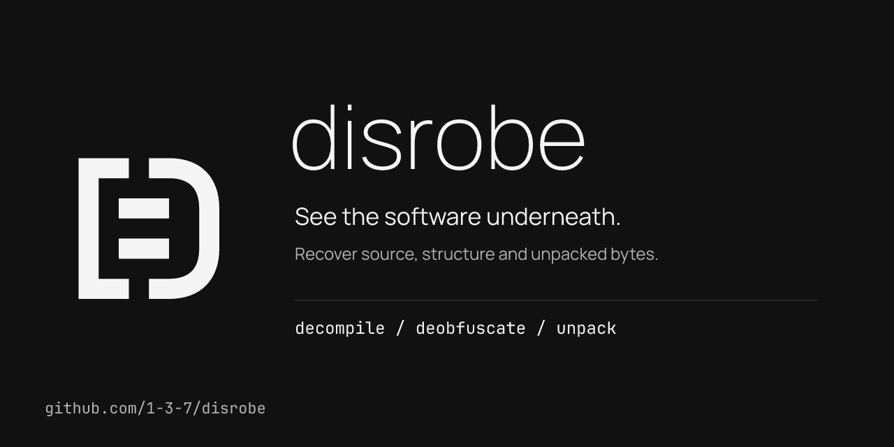
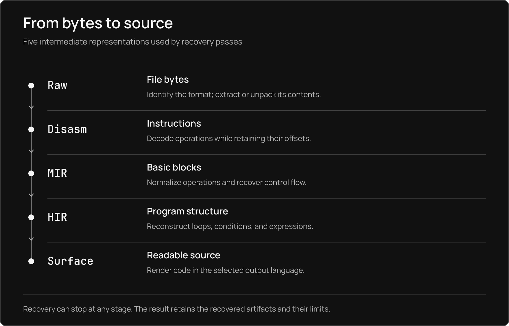

[Get started](#get-started) · [Supported inputs](#find-your-input) · [Automatic recovery](#automatic-recovery) · [Tool comparisons](#compare-tools) · [Evidence](#inspect-the-evidence) · [Documentation](https://1-3-7.github.io/disrobe/)

# See the software underneath

Disrobe is a Rust command-line suite for decompiling, deobfuscating, and unpacking software. Recover Python from bytecode and frozen applications, Java from classfiles and DEX, C# from CIL, JavaScript from bundles, Lua from custom virtual machines, and C or Rust from native code. Extract the files inside installers, firmware, mobile packages, and Electron, Tauri, or Wails applications; carry their symbols, strings, types, and provenance into the next stage of analysis.

The full build catalogs <!-- m:catalog_family_total -->170<!-- /m --> families across <!-- m:catalog_ecosystems -->15<!-- /m --> ecosystems and detects <!-- m:containers_formats -->103<!-- /m --> container formats. `disrobe auto` identifies each layer, runs a matching pass, and follows recovered children into their own recovery paths. Dedicated commands expose finer controls, analysis reports, and optional backends. Recovery runs statically by default; source, structure, partial output, and missing-key boundaries remain distinguishable in the result.

If Disrobe is useful to you, consider [starring the repository](https://github.com/1-3-7/disrobe).

## See it in action

[](https://1-3-7.github.io/disrobe/latest/assets/walkthrough/walkthrough.mp4)

[Watch the full video](https://1-3-7.github.io/disrobe/latest/assets/walkthrough/walkthrough.mp4) · [Read the transcript](https://1-3-7.github.io/disrobe/latest/assets/walkthrough/transcript.txt)

Six terminal commands in 36 seconds: unpack a native binary, extract indicators, run automatic recovery, decompile Lua, and inspect recovered WebAssembly instructions. The [capability map](docs/src/capabilities.md) lists the full command surface and its current support limits.

## Get started

Download the archive for your platform from [GitHub Releases](https://github.com/1-3-7/disrobe/releases), check it against the release's `SHA256SUMS`, and put `disrobe` on your `PATH`. Release archives include signature bundles; the [verification guide](docs/src/security.md#verifying-release-artifacts) explains how to inspect them.

| Platform | Release targets |
|---|---|
| Windows | x86-64, ARM64 |
| macOS | x86-64, ARM64 |
| Linux | x86-64 and ARM64 with glibc; x86-64 with musl |

Check the binary you installed:

```sh
disrobe --version
disrobe --help
```

To build the CLI from a clone, install the repository's Rust toolchain and the [native build prerequisites](docs/src/installation.md), then run:

```sh
cargo build --locked --release -p disrobe-cli --bin disrobe
```

The executable is `target/release/disrobe`, or `target/release/disrobe.exe` on Windows. See the [installation guide](docs/src/installation.md#slim-build) for feature flags and slim builds.

### Recover an application

Start with an application, library, or package:

```sh
disrobe identify path/to/application
disrobe auto path/to/application --out recovered/ --capture-stages
disrobe context --out recovered/
```

`identify` reports the format and available signals. `auto` extracts and recovers the recognized layers. `context` summarizes the resulting passes, confidence, and provenance. With `--capture-stages`, inspect each stage under `recovered/01-*/`, `recovered/02-*/`, and `recovered/final/`; `chain.json` records the topology and hashes, and `recovery.json` records outcomes and timings.

Use a dedicated command when you know the output you need:

```sh
disrobe py decompile module.pyc --out python-source/
disrobe js deob bundle.js --full --out readable.js
disrobe native decompile application.exe --out native-source/
disrobe native export packed.exe --format ghidra --out ghidra-input/
disrobe webview desktop.exe --out frontend/
```

The native decompiler emits C by default on x86-64; `--format rust` selects Rust. AArch64, ARM32, and MIPS32 emit pseudo-C. `native export` rebuilds supported packed PE images for an external analysis tool; `webview` writes the recovered frontend asset tree without starting the application.

### Try a small, inspectable artifact

The repository includes [a tiny WebAssembly module](playground/public/samples/add.wasm) for the browser playground. From a clone, with the full CLI on your `PATH`:

```sh
disrobe wasm decompile playground/public/samples/add.wasm --target json --out add.summary.json
disrobe wasm decompile playground/public/samples/add.wasm --target wat --out add.lifted.wat
disrobe auto playground/public/samples/add.wasm --out recovered/ --capture-stages
```

The first command writes `add.summary.json`; the second writes WebAssembly text to `add.lifted.wat`. Automatic recovery
selects an available chain and writes its artifacts under `recovered/`; `--capture-stages` retains
intermediate results. These operations inspect the module without running its exported function.

Read the result before treating recovery as complete. An identified format can still contain unsupported constructs, absent key material, or no viable recovery chain. The [result guide](docs/src/reading-a-result.md) explains artifacts, diagnostics, partial outcomes, and provenance.

[Open the browser playground](https://1-3-7.github.io/disrobe/playground/) · [Follow the quickstart](docs/src/quickstart.md)

## Find your input

**Recover** means a reachable path emits source, bytes, or structure. **Partial** means it recovers only part of that information. **Detect-only** means it identifies the family without recovering its protected body. These levels describe operations on supported inputs; a family name alone is not a guarantee that every version or configuration recovers. The lists below include the full family catalog and additional formats exposed by dedicated commands and extractors.

| Input | Recovery and output | Commands and guide |
|---|---|---|
| Python | CPython 1.0 to 3.15 bytecode and marshal to source; PyPy, MicroPython `.mpy` v0 to v6, Jython, IronPython, and Brython disassembly; frozen payload extraction; Cython `.pyd`/`.so` names, signatures, and structural fallback | `py`, `pyinstaller`, `pyarmor`, `pyfreeze`, `nuitka` · [Python](docs/src/languages/python.md) |
| JavaScript / TypeScript | Source deobfuscation, minification reversal, module splitting, source maps, V8 cached-data and packaged-runtime inspection | `js` · [JavaScript](docs/src/languages/javascript.md) |
| WebAssembly | `.wasm` to WAT, Rust, TypeScript, C pseudo-source, or JSON; Component Model and GC type-graph inspection; supported obfuscation reversal | `wasm` · [WebAssembly](docs/src/languages/wasm.md) |
| JVM / Android | `.class`, JAR, DEX, APK, AAB; Java source, Kotlin/Scala idioms, manifest and signing information, protector reports and mapping sidecars | `jvm`, `apk` · [JVM and Android](docs/src/languages/jvm-android.md) |
| .NET | PE/CLR metadata and CIL to C#, F#, or VB pseudo-source; ReadyToRun and Native AOT inspection; single-file bundle extraction | `dotnet` · [.NET](docs/src/languages/dotnet.md) |
| Native | PE32/PE64, EFI PE, ELF32/ELF64, kernel modules, thin/fat Mach-O, COFF, MZ, NE, LE, LX, and raw-code identification or analysis; source emission on the architecture-specific paths above | `native`, `macho`, `semdiff` · [Native](docs/src/languages/native.md), [decompile](docs/src/languages/native-decompile.md) |
| Go | PE/ELF/Mach-O runtime metadata, stripped function and type names, `embed.FS` files, garble reports and recoverable literals | `go` · [Go](docs/src/languages/go.md) |
| Swift / Objective-C | Mach-O classes, protocols, fields, selectors, demangled symbols; universal slices; dyld shared-cache dylibs | `swift`, `macho` · [Swift](docs/src/languages/swift.md) |
| Lua | Lua 5.1 to 5.4, LuaJIT 2.0/2.1, Luau bytecode, Garry's Mod Lua (GLua); source and per-input fidelity reports; supported VM and string recovery | `lua` · [Lua](docs/src/languages/lua.md) |
| PHP | Source/eval-chain peeling, literal-key decode loops and AES layers, Phar extraction, serialized `op_array` recovery; commercial encoder envelopes remain key-limited | `php` · [PHP](docs/src/languages/php.md) |
| Ruby | MRI/YARV 2.6 to 3.4 InstructionSequence binaries and mruby RITE bytecode to Ruby; freezer and AOT classification | `ruby` · [Ruby](docs/src/languages/ruby.md) |
| Erlang / Elixir | BEAM modules and EZ archives; surviving abstract code or `Dbgi` to source, Core Erlang fallback, instruction listing | `beam` · [BEAM](docs/src/languages/beam.md) |
| ActionScript 3 | SWF FWS/CWS/ZWS `DoABC` blocks and raw ABC bytecode to disassembly and AS3 pseudocode | `as3` · [ActionScript](docs/src/languages/as3.md) |
| Mobile runtimes | Hermes v60 to v96 header parsing, v76/v84/v96 pseudo-JavaScript lift; Flutter Dart kernel source bodies; ARM64 AOT declarations, strings, and disassembly | `hermes`, `flutter`, `mobile` · [Mobile](docs/src/languages/mobile.md) |
| Shell / documents | PowerShell, Bash, Batch, VBScript, WSH; VBA3/5/6/7 p-code and stomping; Office macro source, BIFF8/BIFF12 XLM formulas, PDF embedded scripts/actions | `shell` · [Shell and documents](docs/src/languages/shell.md) |
| Other language artifacts | Perl op-trees/bytecode, R RDS and Rcpp metadata, Tcl starkits, Haxe JS/SWF/HashLink/Neko outputs; Nim, Zig, Crystal, and D fingerprints, symbols, and partial structure | `auto`, library APIs · [Script languages](docs/src/languages/shell.md), [native](docs/src/languages/native.md) |
| Python pickle | Protocol disassembly, symbolic trace, reconstruction, and classification without calling pickle reducers | `pickle` · [Pickle](docs/src/languages/pickle.md) |
| Archives / firmware / frontends | The complete container list below; Electron ASAR, Tauri v1/v2 embedded maps, Wails v2 `embed.FS` trees | `extract`, `webview`, `auto` · [Containers](docs/src/languages/containers.md), [webview](docs/src/languages/webview.md) |

<details>
<summary><strong>Python: every named freezer, protector, and source obfuscator</strong></summary>

| Family or format | Support and prerequisite |
|---|---|
| PyInstaller 2.x to 6.20+ | Recover embedded archives and bytecode, including supported AES-CTR/CFB layers |
| Nuitka onefile, standalone, module, wheel | Extract onefile payloads; recover symbols and Python-visible structure from compiled forms |
| cx_Freeze, py2exe, shiv, pex, Briefcase | Packager extraction through `pyfreeze`; the command remains experimental |
| PyOxidizer | Experimental, unvalidated extraction |
| SourceDefender `.pye` | Static decryption through `py sourcedefender` and `sourcedefender.decrypt` |
| PyArmor v3 (legacy DES), PyArmor v4 (legacy mixed), PyArmor v5 (legacy AES) | Detect-only: RSA-wrapped key boundary |
| PyArmor v6, PyArmor v7 | Partial static recovery; super mode and unavailable keys restrict output |
| PyArmor v8, PyArmor v9 / 9-Pro | Static wrapper recovery where key material is available. The published <!-- m:pyarmor_frac -->72 / 72<!-- /m --> result counts complete root `CodeObject` decoding only for named v8/v9 default-trial wrappers; it does not establish source equivalence or cover registered-license/pro, BCC, or super mode |
| Kramer / Specter, Berserker, BlankOBF, PlusOBF, Wodx, pyobfuscate.com, pyobfuscate.com (2026 XOR/lambda), PyObfuscator (mauricelambert), Manglify, Oxyry, pyminifier, online obfuscator family, Xindex, Patchwork, pyc-zipper | Static source/loader recovery through the AST evaluator; individual layers and residuals are reported |
| Jawbreaker, ObfuXtreme | Recover the body present in the artifact; runtime-fetched payloads remain absent |
| python-obfuscator (PyPI), pyobfus, Pypacker | Partial wrapper peeling and classification |

PyArmor can need the matching runtime file beside the wrapper. Its dedicated BCC path requires `--allow-bcc` and emits static native lifts plus Python skeletons for modeled bodies; path-aware automatic recovery can publish the same BCC artifacts. Only the PyArmor v6/v7 dynamic hook executes sample code, behind `--allow-dynamic` with a watchdog. `--allow-bcc` permits only in-tree static analysis and does not execute the sample or invoke external tools. [Version and mode details](docs/src/languages/python.md#pyarmor).

</details>

<details>
<summary><strong>JavaScript, WebAssembly, and packaged web applications</strong></summary>

| Family or format | Support and route |
|---|---|
| obfuscator.io / javascript-obfuscator, JS-Confuser | Recover supported string arrays, dispatcher/control-flow transforms, opaque predicates, and loader layers; direct commands and `js.deob` |
| Jscrambler, js-obfuscator (jsobfu) | Partial template and static-transform recovery |
| JSFuck, aaencode, jjencode, JSFiretruck, Dean Edwards Packer | Static decoding through dedicated operations and recognized chain routes |
| JSDefender, Arxan / Digital.ai | Detection and partial static-transform peeling; protected commercial-JS operations require the command's authorization option |
| PACE | Detect-only |
| webpack 4, webpack 5, Vite, Rollup, Rolldown, esbuild, Turbopack, Bun, Parcel, Browserify, SystemJS; AMD modules | Direct unbundling/module recovery. The chain dispatches webpack and Vite; catalog markers for other bundlers do not by themselves make those routes automatic |
| bytenode `.jsc`, Node SEA, nexe, nw.js | Packaged V8 data inspection/carving; Node SEA and bytenode have explicit chain branches |
| Electron ASAR, Tauri v1/v2, Wails v2 | Recover embedded frontend trees; Electron/Tauri use `webview.carve`, Wails uses `go.classify`; direct `webview` handles all three |
| Bun standalone, Deno eszip v2 to v2.3 / `deno compile` | Recover embedded module graphs through the respective container readers; eszip also exposes a direct Rust reader |
| Wobfuscator, Jscrambler WASM, wasm-mixer / Wasmixer | Partial reversal of supported transforms through `wasm.deob`; tool-shaped fixtures grade the transforms, with no committed output from those obfuscators themselves |
| Tigress → Emscripten, wasm-name-obfuscator | Detect and classify; the Tigress helper is outside the `wasm deob` run path, and destroyed original names remain unavailable |

[JavaScript routes](docs/src/languages/javascript.md) · [Wasm limits](docs/src/languages/wasm.md) · [Embedded frontend layouts](docs/src/languages/webview.md).

</details>

<details>
<summary><strong>Native packers, protectors, and obfuscation families</strong></summary>

| Family | Support and route |
|---|---|
| Donut, sRDI | Recover the embedded module from supported shellcode-loader layouts |
| UPX, ASPack, Petite, MPRESS, FSG, PECompact, Yoda's Crypter, NSPack, MEW, kkrunchy | Implemented unpack routines, reachable through `native unpack` and the packer chain; fidelity varies by family and specimen |
| ASProtect, Morphine, nPack, NeoLite, PolyCryptor, Warzone Crypter | `StubEvalPending`: emulator behavior has spec-built stub evidence; real vendor-packed recovery is unvalidated and no unpack dispatch is advertised |
| Yoda's Protector, VMProtect, Themida / WinLicense | CLI and auto detect-only. Separate Rust helpers expose original-assisted carving or protected-section recovery; they do not establish whole-program devirtualization |
| PE-Protector, PELock, Enigma Protector, Armadillo, Obsidium, WinLicense | Detect-only |
| DotNetPatcher, NetCryptor | Delegate the managed layer to the .NET pass |
| OLLVM flattening, bogus control flow, instruction substitution; Tigress CFF | Supported static deobfuscation transforms and reports through the native Rust APIs; applicable analysis appears in native recovery reports |
| Alcatraz, Emotet CFF, Mirai, Dridex, Trickbot, obfus.h, Cryptify (rust-obfuscator), guardian-rs, obfusheader.h, obfuscxx, Amice | Named native obfuscation signatures; individual string/control-flow helpers have narrower recovery than the complete detected family |

Native analysis also recovers Rust/C++ symbols, C++ RTTI and vtables, Delphi/C++Builder object models and DFM resources, DWARF/PDB/STABS information, imports, call graphs, crypto signatures, and FLIRT matches. Instruction analysis spans x86, ARM, RISC-V, MIPS, PowerPC, SPARC, eBPF, and AVR; source emission is the smaller architecture set listed above. [Native analysis](docs/src/languages/native.md) · [Unpacking and byte-recovery evidence](docs/src/languages/native-unpack.md) · [Deobfuscation](docs/src/anti-analysis.md).

</details>

<details>
<summary><strong>JVM, Android, .NET, and mobile package families</strong></summary>

| Family | Support and prerequisite |
|---|---|
| Zelix KlassMaster, Allatori, Stringer, DashO | String recovery for supported patterns, followed by classfile decompilation |
| DexGuard | Detection, structural peeling, and in-class string-decrypt emulation for supported keyed constants |
| BlackObfuscator | DEX dispatcher recognition and block-order annotation |
| ProGuard / R8 | Mapping replay to a name-restoration sidecar; original names require `mapping.txt` |
| yGuard, SkidSuite2, JBCO | Detect-only |
| Promon SHIELD, Guardsquare DexGuard RASP, Guardsquare ThreatCast, Appdome, OneSpan, Arxan / Digital.ai, Zimperium zShield, Licel DexProtector | Android RASP identification and structural reports |
| ConfuserEx2 | Real-sample constant recovery and control-flow deflattening; encrypted resources can retain a runtime-key boundary |
| Eazfuscator.NET | Model-graded string decryption and VM lifting; the VM fixture comes from an in-repository virtualizer, not the shipping product |
| KoiVM (ConfuserEx VM) | Virtualized bodies lifted to CIL on committed real-tool output |
| ConfuserEx, Dotfuscator, Dotfuscator CE, SmartAssembly, Babel, DeepSea, Spices.Net, Goliath, Skater, .NET Reactor, CryptoObfuscator, ArmDot, Agile.NET, Obfuscar, DotNetPatcher, NetCryptor, BitMono | Detection and family-specific partial recovery: names, strings, resources, or method structures. BitMono is in the protector detector beyond the 22-entry .NET chain catalog |
| Themida (.NET wrapper), ILProtector, MaxToCode | Detect-only for native-loader-keyed bodies |
| React Native APK, React Native IPA; React Native Hermes bytecode | Extract JS/Hermes payloads and route supported bytecode into the Hermes lift |
| Flutter Dart kernel; Flutter AOT snapshot (`libapp.so`) | Kernel source-table recovery; AOT declarations, metadata, and ARM64 disassembly. Snapshot version and available names constrain recovery |
| Xamarin / .NET MAUI APK, Apache Cordova APK, Capacitor APK, NativeScript APK | Runtime identification and supported package/member extraction |
| Android APK (`classes.dex`), Android app bundle (AAB / APKM / XAPK), IPA | Package inspection and child extraction; downstream recovery depends on the embedded runtime |

The .NET string decoders for SmartAssembly, Spices.Net, Skater, .NET Reactor, Eazfuscator.NET, and CryptoObfuscator are graded on modeled algorithms, not committed vendor-produced assemblies. ConfuserEx2, Obfuscar, and BitMono have real protected-assembly evidence. [JVM/Android](docs/src/languages/jvm-android.md) · [.NET](docs/src/languages/dotnet.md) · [Mobile](docs/src/languages/mobile.md).

</details>

<details>
<summary><strong>Lua, PHP, shell, Ruby, BEAM, Swift, Go, and ActionScript families</strong></summary>

| Family | Support and prerequisite |
|---|---|
| IronBrew2 | VM recovery, execution-differentially checked on real 2.7.0 standard and MAX output |
| Prometheus | Partial recovery, including supported stacked `Vmify` dispatch trees |
| MoonSec V1, MoonSec V2, MoonSec V3, AztupBrew, DarkSec, Boronide, PSU, WeAreDevs LuaU, luaobfuscator.com, SLua (Unity Lua 5.3), Hercules | Partial Lua recovery; MoonSec-shape VM evidence uses a synthetic bootstrap |
| Luraph | Detect-only |
| Luau bytecode, Garry's Mod Lua (GLua) | Dialect recognition; Luau lifting and partial GLua recovery |
| ionCube, SourceGuardian, Zend Guard | Commercial PHP envelope detection; loader-resident keys remain a boundary. Legacy static-key cases can yield partial `op_array` structure |
| FOPO, Better PHP Obfuscator | Static PHP eval-chain peeling, with literal-key requirements for encrypted layers |
| Invoke-Obfuscation (token), Invoke-Obfuscation (AST), Invoke-Obfuscation (string), Invoke-Obfuscation (encoding), Invoke-Obfuscation (compress); Invoke-Stealth, PowerHell, Chameleon, psobf | Static PowerShell recovery |
| Invoke-Obfuscation (launcher), ISESteroids | Partial PowerShell recovery |
| Bashfuscator (token), Bashfuscator (string), Bashfuscator (obfuscate), Bashfuscator (compress); Bash indirection (IFS/eval); node-bash-obfuscate (chunk-table eval) | Static Bash recovery |
| Batch obfuscation (`%random%`), Batch obfuscation (set indirection); VBA macro (p-code decompile + stomping) | Batch peeling and VBA source/p-code recovery |
| YARV InstructionSequence (compiled `.rb`), mruby RITE bytecode | Ruby source recovery |
| OCRA self-extracting executable, RubyScript2Exe package | Partial freezer classification/recovery |
| JRuby compiled class, TruffleRuby native image | Detect-only through the Ruby catalog |
| BEAM file (Erlang / Elixir compiled module), EZ archive (ZIP-wrapped `.beam` modules) | Module extraction, source/debug-chunk recovery, or Core Erlang fallback |
| garble | Go metadata and supported literals; original name hashing cannot be reversed without the missing seed |
| Mach-O Swift / Objective-C metadata, Mach-O fat (universal) binary, dyld shared cache | Runtime metadata, slice and dylib recovery |
| SwiftShield | Mapping parser; the mapping must be supplied to recover original names |
| SWF (Flash, FWS/CWS/ZWS) DoABC, raw ABC bytecode | Disassembly and method-body pseudocode |
| secureSWF, DoSWF, Kindi, Irrfuscator, swfLock | Detect-only |

[Family catalog](docs/src/catalog.md) · [Lua](docs/src/languages/lua.md) · [PHP](docs/src/languages/php.md) · [Shell](docs/src/languages/shell.md) · [Ruby](docs/src/languages/ruby.md) · [BEAM](docs/src/languages/beam.md) · [Go](docs/src/languages/go.md) · [Swift](docs/src/languages/swift.md) · [AS3](docs/src/languages/as3.md).

</details>

<details>
<summary><strong>All 103 registered container formats</strong></summary>

| Category | Formats |
|---|---|
| General archives | ZIP, TAR, tar.gz, tar.bz2, tar.xz, tar.zst, 7z, RAR, CAB, CPIO, ar, ARJ, ARC, LZH, LZO/lzop, uzip, Xamarin xalz, PAR2, StuffIt |
| Application and language archives | JAR, WAR, APK, XPI, WHL, EGG, CRX, NUPKG, VSIX, PYZ, Electron ASAR |
| Installers and application images | PKG, DMG, DEB, RPM, AppImage, Snap, Flatpak, MSIX/APPX, MSI, NSIS, Squirrel, Inno Setup, InstallShield, Enigma Virtual Box |
| Filesystems and filesystem streams | SquashFS, cramfs, ext4, romfs, MinixFS, Android sparse, btrfs-send, EROFS, JFFS2, NTFS, UBI/UBIFS, YAFFS2, QNX, partclone |
| Disk and deployment images | ISO, OCI, Docker image, VHD, VHDX, WIM, GPT, MBR, FAT12/16/32 |
| Compression streams | XZ, gzip, bzip2, zstd, LZMA, lzip, LZ4, zlib, Unix compress (`.Z`) |
| Embedded application data | Bun standalone, UnityFS, .NET single-file bundle |
| Firmware | D-Link SHRS, ENCRPTED_IMG, alpha v1, alpha v2, DEAFBEAD, FPKG; EnGenius; Autel ECC; QNAP; Netgear CHK, TRX v1, TRX v2; Xiaomi HDR1, HDR2; Tesla SBFH; HP BDL, IPKG; Moxa FRM; INSTAR BNEG, HD; Airoha; UEFI firmware volume |
| Memory and encrypted volumes | Windows minidump, LUKS1 |

The roster declares detection for every entry. Of those routes, 102 use the generic extractor; <!-- roster-breadth:containers-exercised -->42<!-- /roster-breadth --> have committed inputs that reach member bytes, DMG has detection-only committed evidence, and 59 have no committed input. LUKS1 is graded separately against plaintext and requires an `aes-cbc-plain` raw volume key for decryption; without one it reports the key boundary. Individual compression methods, encrypted members, split volumes, and filesystem features have narrower limits. StuffIt 5 currently returns the archive blob through extraction even though its fork decoders exist. Airoha OTP-AES content is carved verbatim.

Additional Rust readers expose Deno eszip, Apple APFS/HFS+, ELF appended overlays, and Blazor WebCIL structures; they are not extra entries in the 103-format count. [Extraction routes, method versions, and limits](docs/src/languages/containers.md) · [Container registry](crates/disrobe-binfmt/src/container.rs).

</details>

## Automatic recovery

`auto` chooses a pass from the compiled registry, runs it, then re-identifies its output and extracted children. It stops at the confidence threshold, a repeated content hash, or the depth limit (eight by default). Reports and source files tagged as terminal remain outputs rather than being fed back into detection. The following table accounts for every pass registered by a full build; a slim build can omit feature-gated rows.

| Input layer | Registered pass IDs | Automatic output | Dedicated controls or prerequisite |
|---|---|---|---|
| Archives, installers, firmware, volumes | `binfmt.container` | Extracted children, followed recursively into language/native passes | `extract` for member reports and the explicit LUKS1 raw-key option |
| PyInstaller | `pyinstaller.extract` | Embedded members and `.pyc` children | `pyinstaller extract` for archive-specific options |
| Python freezers | `pyfreeze.extract`, `nuitka.extract` | Extracted payloads or supported compiled-package structure | Experimental `pyfreeze`; Nuitka flavor determines what survives |
| Protected Python | `pyarmor.unpack`, `sourcedefender.decrypt` | Available plaintext/bytecode, metadata, or key-boundary reports | Matching runtime/key material; dedicated PyArmor mode and strictness options |
| Python source and bytecode | `py.deob`, `py.decompile`, `py.disasm` | Peeled source, decompiled source, or instruction trace | `py decompile --emit source,disasm,ast`; a matching interpreter is needed for recompilation checks |
| Pickle | `pickle.classify` | Symbolic analysis and classification | `pickle` for the individual inspection/reconstruction operations |
| JavaScript | `js.deob` | Supported deobfuscation, webpack/Vite module recovery, Node SEA/bytenode handling | `js unbundle` exposes the broader bundler set; source maps and rename options are direct controls |
| WebAssembly | `wasm.deob` | Recovered or lifted WAT plus detection, summary, and recovery sidecars | `wasm decompile --target` chooses Rust, TypeScript, C, WAT, or JSON |
| Electron / Tauri | `webview.carve` | Embedded frontend members | `webview` also supports Wails; automatic Wails recovery uses `go.classify` |
| PHP / Phar | `php.peel` | Peeled source, `op_array` output, archive children, residual/key reports | Keys and IVs must be statically available for encrypted layers |
| JVM / DEX | `jvm.classify` | Java source, protector and recovery manifests, class/archive children | `jvm`/`apk` for mapping, signatures, and optional external backends |
| .NET | `dotnet.classify` | C# and analysis, recovered constants/resources/CIL, or Native AOT metadata | `dotnet` for other source formats and installed rendering backends |
| Mobile packages / bytecode | `mobile.classify` | Runtime/member extraction, Hermes lift, Dart kernel source or AOT reports | `hermes`, `flutter`, `mobile` for format-specific controls |
| Lua | `lua.deob` | Recovered Lua and dialect/fidelity sidecars | `lua` for explicit family and output controls |
| Shell / Office / PDF | `shell.deob` | Peeled scripts, macro source/p-code, XLM and document reports | `shell` for document-specific operations |
| Ruby | `ruby.classify` | Analysis plus recovered YARV/mruby source where available | `ruby` for flavor-specific reports; JRuby/TruffleRuby classification is not Ruby source recovery |
| BEAM / EZ | `beam.classify` | Erlang/Elixir/Core Erlang, disassembly, archive children | Surviving debug chunks determine source fidelity |
| SWF / ABC | `as3.classify` | ABC structure, instruction listings, AS3 pseudocode | Named commercial obfuscators remain detect-only |
| Go | `go.classify` | Symbols, types, garble analysis, and embedded filesystem members | `go` for DWARF, BuildInfo, and other dedicated reports |
| Swift / Objective-C | `swift-objc.classify` | Metadata, universal slices, and shared-cache dylibs | Sibling sub-cache/symbol files may be needed; direct `swift`/`macho` controls |
| Native packers | `native.packer-unpack` | Available unpacked image or embedded module, symbols, signatures, recovery reports | Only implemented packer dispatches unpack; commercial VM tiers can stop at detection |
| Native images | `native.image-classify` | Identity, symbols, signatures, findings, and a bounded x86-64/AArch64 pseudo-source report | `native decompile` selects a full source-output command; ARM32/MIPS32 source paths are direct |
| Windows / OS/2 NE | `native.ne-structure` | Segments, entries, imports, and resources | Structural recovery rather than source decompilation |
| Perl / R / Tcl / Haxe / WSH | `scriptlang.classify` | Language reports, recovered structures, and supported child artifacts | Per-format library APIs expose finer operations |
| Nim / Zig / Crystal / D | `nativelang.classify` | Language fingerprints, symbols, and partial native structure | Classification requires sufficient surviving language markers |

For example, a recognized PyInstaller application can progress through `pyinstaller.extract` → `pyarmor.unpack` → `py.decompile`; an APK through member extraction → DEX → Java; and a packed native image through unpacking → language or image analysis. Each arrow depends on what that particular layer actually yields.

```sh
disrobe passes
disrobe catalog python --json
disrobe auto input-directory/ --out recovered/ --batch-max-depth 6 --capture-stages
disrobe chain module.pyc --chain py.decompile --out python-source/
```

`scan`, `frisk`, `taint`, `vulnmatch`, explicit source-target selection, mapping replay, and optional external-backend invocation remain dedicated operations. [Pass registry](crates/disrobe-passes/src/lib.rs) · [Chain selection and output layout](docs/src/chain.md).

### Analyze and export the result

| Task | Commands | Output or next step |
|---|---|---|
| Find indicators, secrets, and static findings | `scan`, `frisk`, `strings`, `ioc`, `indicators`, `behavior` | [Findings and offsets](docs/src/frisk.md) |
| Inspect functions, flows, and behavior | `query`, `capabilities`, `taint`, `vulnmatch` | [Queryable IR](docs/src/query.md), ATT&CK/MBC mappings and source-to-sink reports |
| Keep annotations and structured artifacts | `annot`, `rename`, `envelope`, `verify`, `yara` | [Artifact envelopes](docs/src/envelope.md) and analyst state |
| Follow provenance and compare runs | `chain`, `context`, `status`, `report`, `diff`, `guard`, `semdiff` | [Reports](docs/src/cli/report.md), hashes, and recovery differences |
| Collect public network data | `prowl` | [Explicit network collection](docs/src/forensics-safety.md), separate from offline recovery |

The [capability map](docs/src/capabilities.md) covers command groups and integrations. Its
[machine-readable inventory](evidence/capabilities.json) links source, tests, documentation, support
status, and demos. The [CLI reference](docs/src/cli/reference.md) covers nested commands;
[global flags](docs/src/cli/global-flags.md) cover shared options. Use `disrobe <command> --help`
for the interface of your installed build.

Project and service commands are also indexed there: `serve`, `plugin`, `init`, `config`, `catalog`, `passes`, `doctor`, `install`, `install-deps`, `self-update`, `completions`, `man`, `explain`, and `bug-report`. Use `doctor` to probe 46 to 51 external tools depending on the platform and identify missing optional backends.

## Use the same recovery in your workflow

| Surface | Entry point | Guide |
|---|---|---|
| Rust | Shared core types and individual pass crates | [Library APIs](docs/src/library.md) |
| Python | Typed bindings through `import disrobe` | [Python bindings](docs/src/python-bindings.md) |
| HTTP, gRPC, and LSP | `disrobe serve` | [Service](docs/src/cli/serve.md) |
| Model Context Protocol | `disrobe-mcp` or `disrobe serve --mcp` | [MCP integration](docs/src/integrations/mcp.md) |
| Editors and analysis tools | VS Code, IDA Pro, Ghidra, Binary Ninja | [Editor integrations](docs/src/integrations/editor-plugins.md) |
| GitHub Actions | Repository action and SARIF output | [GitHub Action](docs/src/integrations/github-action.md) |
| Local commit checks | Hook ID `disrobe` | [pre-commit](docs/src/integrations/pre-commit.md) |
| Browser | Client-side Wasm worker | [Playground](docs/src/playground.md) |
| Project context for coding tools | `disrobe init --ide` | [Metadata sidecar](docs/src/llm-sidecar.md) |

## Compare tools

The table maps each recovery task to Disrobe’s commands and related tools. Installed decompilers and exported artifacts provide the integration points shown below.

| Recovery task | Named tools | Disrobe's path | How to choose or combine them |
|---|---|---|---|
| Python bytecode to source | pycdc, PyLingual, uncompyle6, decompyle3 | In-process CPython 1.0 to 3.15 decompiler, nested code-object recovery, source/disassembly/AST output | Inspect recovered source, disassembly, and AST from the built-in Python decompiler |
| Frozen Python extraction | pyinstxtractor-ng, pydecipher | PyInstaller, Nuitka, and freezer extraction followed by bytecode recovery | `auto` can continue from the extracted member through a protector and into the Python decompiler |
| PyArmor | Pyarmor-Static-Unpack-1shot | Static wrapper/runtime recovery, mode reports, optional static BCC lifting | Supply the matching runtime to recover wrapper data and inspect mode-specific results |
| Pickle inspection | fickling, Python `pickletools` | Instruction trace, symbolic reducers, classification, and value reconstruction | Inspect without executing reducers; `pickletools` grades inspection, and CPython checks reconstruction on 470 generated fixtures |
| JavaScript deobfuscation | webcrack, synchrony, REstringer | obfuscator.io, JS-Confuser, supported Jscrambler patterns, esoteric decoders, constant/control-flow recovery | Use `js deob` for explicit options or `auto` when JS is inside a package |
| JS unbundling and source maps | wakaru, webcrack, sourcemapper | Module extraction, source-map handling, scope-aware renaming, packaged V8 inspection | `js unbundle` exposes more bundler routes than automatic chain dispatch |
| WebAssembly | WABT `wasm-decompile`, Binaryen | WAT and C/Rust/TypeScript pseudo-source, JSON summaries, supported obfuscation reversal | Inspect a selected source target; wasmtime execution checks below grade recovered behavior independently |
| JVM source | CFR, Vineflower, Procyon, Fernflower | Native classfile recovery plus protector/string handling | `jvm decompile` writes Disrobe artifacts alongside output from an installed backend; CFR has a measured compile-yield result below |
| Android packages and DEX | JADX, apktool, androguard, dex2jar | In-process Dalvik recovery, APK metadata/signatures, runtime extraction, Java output | DEX/APK decompilation defaults to the native path; an Android backend is selected explicitly. JADX has a measured leg below |
| .NET assemblies | ILSpy, dnSpy, dnSpyEx, de4dot | CIL recovery plus protector-specific constants, resources, VM bodies, and Native AOT metadata | `dotnet decompile` writes Disrobe CIL output alongside an installed renderer; `--backend auto` selects ILSpy, dnSpyEx, dnSpy, or de4dot |
| Native decompilation | Ghidra, IDA, Binary Ninja | In-process x86-64 C/Rust and AArch64/ARM32/MIPS32 pseudo-C; recovered symbol/type reports | Select Ghidra headlessly with `--backend ghidra`, or use editor integrations and exported symbols in an interactive analysis session |
| Packed native executables | `upx -d`, unipacker, Detect It Easy | Implemented unpackers and bounded stub emulation, rebuilt PE images, embedded loader modules | Export recovered PE images into Ghidra/IDA. The Ghidra measurements below compare the packed and rebuilt inputs |
| Native obfuscation | Ghidra, IDA, Binary Ninja and deobfuscation scripts | OLLVM/Tigress transforms, MBA simplification, stack strings, native metadata and recovery reports | Select the relevant native operation/API; a VM-protector fingerprint alone does not imply body recovery |
| Go metadata and garble | GoReSym, redress, gore | `pclntab`, module/type metadata, embedded files, and recoverable garble literals | `go` reports names/types; `native decompile` handles the machine-code source path separately |
| Swift / Objective-C | `swift-demangle`, class-dump, jtool2 | Runtime class/protocol/selector data, symbol rendering, fat slices, shared-cache dylibs | Supply surviving mappings and sub-cache files; original names erased by renaming need an external map |
| Lua bytecode and VMs | unluac, luadec, LuaDec51 | Lua/LuaJIT/Luau source plus supported obfuscator and custom-VM recovery | IronBrew2 has real-tool execution-differential evidence; ordinary `.luac` recovery and VM recovery are different operations |
| Ruby bytecode | MRI disassembly | YARV and mruby source, opcode listings, freezer/AOT classification | MRI recompilation grades opcode-name recall; that measure does not establish execution equivalence |
| PHP layers | php-malware-finder | Eval-chain and literal-key loop/cipher peeling, Phar extraction, encoder-envelope reports | Use static layers and available key material; native-loader-keyed commercial payloads stay sealed |
| PowerShell, Bash, VBA | PowerDecode, FLARE tools, olevba | Shell deobfuscation, VBA source/p-code and stomping, XLM formulas, PDF actions | `shell` places script recovery and document findings beside the rest of the artifact analysis |
| BEAM / ActionScript | Erlang `beam_disasm`, RABCDAsm | BEAM debug-source/Core Erlang recovery and ABC method-body pseudocode | Preserve debug chunks when available; stripped BEAM has a separate real-Erlang execution check |
| Hermes / React Native | hermes-dec, hbctool, [DroidSaw](https://github.com/droidsaw/droidsaw) | Runtime extraction, HBC structure, supported pseudo-JavaScript lift | HBC parsing covers v60 to v96; source lifting has a narrower measured boundary. Hermes-to-DEX bridge taint is not implemented |
| Flutter / Dart AOT | reFlutter, Darter, blutter | Kernel source tables, AOT declaration graph, ARM64 bodies, strings, rename-map parsing | Kernel source and AOT metadata are different recovery levels; snapshot versions constrain AOT parsing |
| Containers and firmware | binwalk, unblob, 7-Zip | Registered format extraction, recursive child routing, firmware decoding/carving, per-member refusal reports | Feed extracted members straight into language passes; compare member bytes rather than treating a recognized magic as successful extraction |
| Secrets and indicators | APKLeaks, TruffleHog, Gitleaks, LinkFinder | Recovered-tree/APK findings, token offsets, static strings, secret and IOC reports | Scan the APK or recovered tree; compare APKLeaks against the same planted secrets below |
| Format, packer, compiler identification | Detect It Easy, TrID, PEiD, binwalk | Multi-signal identification, symbols, signatures, and routing hints | Use `identify`/`detect` to select a recovery path, then inspect its actual output |
| Capabilities and taint | capa, Ghidra scripts, Joern | ATT&CK/MBC findings with offsets, normalized-IR queries, source-to-sink flow reports | Run capability matching and source-to-sink analysis on recovered artifacts; the taint report includes its Juliet test population |

The [comparison inventory](evidence/edge-comparison.md) names the outstanding shared-input comparisons. Backend options are documented in [installation](docs/src/installation.md#optional-external-backends) and the linked language guides above.

### Measured tool comparisons

Measurements use the pinned inputs, tool versions, and scoring rules linked below. DEX and JAR counts measure compilation of each tool’s emitted regions. Those populations differ, so their counts do not rank recovery quality. APK secret recall uses the same eight-token ground truth.

| Tool and input | Disrobe result | Named tool result | What the measurement checks |
|---|---|---|---|
| JADX 1.5.5 · committed EdgeCases DEX | 63 clean regions from 163 emitted | 281 clean regions from 303 emitted | Real `javac`, complete-source compilation then bounded isolation of regions blocking attribution; different emitted populations |
| CFR 0.152 · committed EdgeCases JAR | 181 clean regions from 181 emitted | 152 clean regions from 166 emitted | The same compiler/scorer procedure; different emitted populations |
| APKLeaks 2.6.3 · planted-secrets APK | 8 / 8 planted secrets | 5 / 8 planted secrets | Exact-token recall on the same APK; Disrobe also finds the planted AWS secret access key, Basic credential, and JWT |

[Inputs, raw tool results, and reproduction commands](benches/head-to-head/results.md).

### Give Ghidra the recovered executable

The same Ghidra 12.1.2 analysis sees different code after Disrobe exports a packed executable as a rebuilt PE. These local snapshots use real benign packed fixtures and record both increases and decreases. The function/instruction/string columns come from the nine-input analysis snapshot; completed C renderings come from the separate six-input decompiler snapshot. A completed rendering is nonempty output, not a source-correctness grade.

| Packed input | Ghidra functions, packed → rebuilt | Instructions, packed → rebuilt | Strings, packed → rebuilt | Completed C renderings, packed → rebuilt |
|---|---|---|---|---|
| UPX · Rust hello | 4 → 287 | 225 → 19,060 | 23 → 179 | 4 → 287 |
| ASPack · Clockres | 5 → 243 | 58 → 10,544 | 48 → 116 | 5 → 210 |
| ASPack · AccessEnum | 5 → 101 | 73 → 5,781 | 62 → 195 | 5 → 101 |
| PECompact · Clockres | 2 → 306 | 148 → 14,603 | 27 → 27 | 1 → 267 |
| PECompact · AccessEnum | 2 → 186 | 155 → 9,278 | 52 → 53 | 2 → 186 |
| MEW · Clockres | 4 → 333 | 125 → 20,990 | 3 → 358 | Not measured |
| MEW · AccessEnum | 4 → 152 | 125 → 9,592 | 3 → 802 | Not measured |
| MEW · Autologon | 4 → 295 | 125 → 19,595 | 3 → 406 | Not measured |
| kkrunchy classic · NASM hello | 4 → 1 | 149 → 10 | 3 → 4 | 4 → 1 |

The kkrunchy counts decrease. More discovered functions are not necessarily more correct functions, and these analysis counts do not replace a byte comparison. Read the [analysis snapshot](benches/ghidra-cleaner-input/snapshots/20260909T0004299135535Z-8f91eda104b94abca206af5ff93d239c/results.md), [decompiler snapshot](benches/ghidra-unpack/snapshots/20260908T2346015895555Z-d536dd0feebe46c19cd59456bef1efc1/results.md), and separate [native byte-recovery measurements](benches/native-unpack/results.md).

## Inspect the evidence

The [evidence index](evidence/README.md) links recovery measurements to their fixtures, comparison methods, commands, and results.

Results distinguish byte recovery, compiler acceptance, and behavioral checks. Compiler acceptance and coverage counts are not equivalence scores.

<details>
<summary><strong>JADX/CFR scoring details and reproduction commands</strong></summary>

| Input | Disrobe emitted regions | Named tool emitted regions | Population boundary | Reproduce |
|---|---|---|---|---|
| <!-- evidence-pair:apk-jadx-cfr:dex -->Android DEX | 63 / 163 emitted regions compile clean | JADX 1.5.5: 281 / 303 emitted regions compile clean | no cross-tool ranking: each tool has its own emitted-region population | `cargo run --locked -p disrobe-bench-head-to-head -- --check --only apk-jadx-cfr`<!-- /evidence-pair --> |
| <!-- evidence-pair:apk-jadx-cfr:jar -->JVM classfile | 181 / 181 emitted regions compile clean | CFR 0.152: 152 / 166 emitted regions compile clean | no cross-tool ranking: each tool has its own emitted-region population | `cargo run --locked -p disrobe-bench-head-to-head -- --check --only apk-jadx-cfr`<!-- /evidence-pair --> |

</details>

### Recovery checked against independent references

These checks measure Disrobe against an original artifact, compiler, interpreter, or labeled corpus. They are distinct from comparing two decompilers. Each linked result records the input population, prerequisites, and reproduction command.

| Recovery | Recorded result | Reference and limit |
|---|---|---|
| Python 3.14.5, pinned modules | <!-- m:py_stdlib_pinned_count -->6077 of 6286<!-- /m --> code objects | CPython recompilation with normalized opcode-structure comparison; jump targets, most operands, and additional recovered objects are not graded. [Result](evidence/results/py-stdlib-recompile.md) |
| Python 3.14.5, fixed core population | <!-- m:py_stdlib_full_count -->17396 of 18276<!-- /m --> code objects, local measurement | The same normalized comparison across <!-- m:py_stdlib_full_modules -->574<!-- /m --> modules; this is not a semantic-equivalence result. [Result](evidence/results/py-stdlib-full.md) |
| Legacy Python 1.0 to 3.7 | at least <!-- m:py_legacy_count -->150 of 191<!-- /m --> fixtures (regression floor) | Period-interpreter recompilation or structural tokens against original source. [Result](evidence/results/py-legacy-recompile.md) |
| Pickle classification | 102 / 102 classification fixtures | `pickletools` semantics. [Result](evidence/results/pickle-corpus.md) |
| Pickle reconstruction | <!-- m:pickle_roundtrip_frac -->470 / 470<!-- /m --> reconstructed fixtures pass re-execution equality checks | CPython re-execution. [Result](evidence/results/pickle-roundtrip.md) |
| JVM source compilation | <!-- m:jvm_per_method_count -->131 of 131<!-- /m --> methods compile | Real `javac`. [Result](evidence/results/jvm-javac-recompile.md) |
| JVM behavior | 117 / 131 methods match observed execution | Real JVM; eight methods diverge and six are not driven in isolation. [Result](evidence/results/jvm-execution-differential.md) |
| Android DEX | <!-- m:dalvik_verifier_frac -->118 / 118<!-- /m --> verifier-presented classes | JVM `-Xverify:all`; <!-- m:dalvik_link_skipped_count -->37 of 155<!-- /m --> classes are link-skipped and ungraded. [Result](evidence/results/dalvik-verifier.md) |
| .NET C# | 18 / 35 complete EdgeCases types recompile standalone | Real Roslyn `csc`; legal source does not establish equivalent behavior. [Result](evidence/results/dotnet-whole-type-recompile.md) |
| .NET VM bodies | Eazfuscator model: 67 / 67 instructions; real KoiVM: 6 / 6 bodies lifted | Separate original/clean-build references; EazVM uses an in-repository virtualizer, KoiVM uses real-tool output. [Evidence](docs/src/languages/dotnet.md) |
| WebAssembly | <!-- m:wasm_execution_frac -->57 / 57<!-- /m --> eligible functions | wasmtime compares returns, traps, and the first 4,096 bytes of linear memory on the test inputs. [Result](evidence/results/wasm-wasmtime-diff.md) |
| BEAM without debug chunks | <!-- m:beam_recompile_frac -->19 / 19<!-- /m --> modules | Erlang/OTP 27.3.4 recompilation, export comparison, and `test/0` output/exit status. [Result](evidence/results/beam-erlang-recompile.md) |
| Lua IronBrew2 | Real 2.7.0 standard and MAX output recovers to matching execution | Real Lua interpreter against original programs; one VM family. [Result](evidence/results/lua-ironbrew.md) |
| Ruby YARV | Greeter <!-- m:ruby_greeter_pct -->100%<!-- /m -->; megafile <!-- m:ruby_megafile_pct -->98.67%<!-- /m --> opcode-name recall | MRI recompilation; multiset recall ignores order, operands, branch targets, and extra instructions. [Result](evidence/results/ruby-yarv-recompile.md) |
| Go stripped type names | <!-- m:go_typename_count -->838 of 838<!-- /m --> names | Real go1.26.3 metadata from the comparison build. [Result](evidence/results/go-typemeta.md) |
| Hermes HBC v96 | <!-- m:hermes_opcoverage_count -->8 of 8<!-- /m --> functions, zero fallback operations | Real `hermesc` sample with original source and function names. [Result](evidence/results/hermes-opcoverage.md) |
| Native packed bytes | UPX, FSG, NSPack, Petite, MPRESS `.text` byte-identical on named committed pairs; Yoda's Crypter resources byte-identical | RVA-aligned original bytes; whole-image and resource residuals remain separately reported. [Per-input table](benches/native-unpack/results.md) |
| Planted indicators | 6 / 6 IOC categories represented | Committed endpoints, manifest findings, URLs, IPv4, email, and `.onion` ground truth. [Result](evidence/results/frisk-planted.md) |
| MCP call graph | 5 / 5 direct edges, all correctly identified | Stripped ELF compared with its distinct unstripped toolchain twin. [Precision](evidence/results/mcp-direct-call-precision.md), [recall](evidence/results/mcp-direct-call-recall.md) |
| Native taint | 93 / 190 labeled flows recalled; zero false positives, local measurement | NIST Juliet CWE-78 char/system slice, gcc 16.2.0 `-O2`; seven declared flow categories have no cases in this slice. [Result](evidence/results/taint-juliet-cwe78.md) |

<details>
<summary><strong>Coverage counts and their smaller correctness populations</strong></summary>

| Surface | Count | What it establishes |
|---|---|---|
| PyArmor | <!-- m:pyarmor_frac -->72 / 72<!-- /m --> named v8/v9 default-trial wrappers | Static decryption and complete root `CodeObject` parsing, without an external correctness comparison |
| Android, three real APKs | <!-- m:dalvik_body_frac -->83662 / 83943<!-- /m --> methods lowered, local | Self-reported body coverage. The separate verifier population is <!-- m:dalvik_body_attested_frac -->2988 of 2998<!-- /m --> bodies presented in isolated carriers |
| Wasm instruction inventory | <!-- m:wasm_opcoverage_count -->1034 of 1034<!-- /m --> instructions | External `wasm-tools` denominator and re-assemblable WAT; the lowering numerator is self-counted |
| Luau instruction table | <!-- m:luau_opcode_lift_count -->86 of 88<!-- /m --> entries lifted | Disrobe's declared table; `BREAK` and `NEWCLASSMEMBER` remain decoded but unresolved |
| Swift symbols | Committed symbol population renders to pinned strings | Regression consistency, with no required external demangler comparison |
| OLLVM flattening | <!-- m:native_cff_cover_states -->9<!-- /m --> reached states out of <!-- m:native_cff_dispatcher_states -->9<!-- /m --> derived states | Dispatcher-state coverage over two committed functions; both counts are derived in-process |
| Mixed boolean arithmetic | 316 entries; reference run answered 247 and refused 69; external solver proved 236 answers and refuted none | Budgeted recovery and held-out originals; unanswered or unproven entries do not become solver-proved results |
| Containers | <!-- roster-breadth:containers-exercised -->42<!-- /roster-breadth --> generic routes write member bytes | Exercised breadth within the <!-- m:containers_formats -->103<!-- /m --> detected formats; LUKS1 has its own plaintext comparison |

[Complete evidence records](evidence/results/EVIDENCE.md) describe each population and grading rule.

</details>

Chart labels use `strong` for an independent correctness reference, `recompile-only` for compiler acceptance, and `coverage-self-reported` for Disrobe's own coverage counters. The comparison method and population define each result's scope.

Browse the [results](evidence/results/EVIDENCE.md), [tool comparisons](evidence/edge-comparison.md), and [reproduction prerequisites](evidence/README.md) for individual measurements.

## Know the limits

- **Compiled output loses information.** Original comments, formatting, names, and some type information may be absent.
- **Family recognition is broader than recovery.** A catalog match or successful parser can coexist with partial source emission. Read the family tier and the actual result.
- **Native recovery depends on architecture and output language.** The [native guide](docs/src/languages/native-decompile.md) lists supported paths and their tests.
- **Commercial VM-protector detection is not a general source-recovery promise.** Internal helpers and protected-section artifacts do not establish a complete CLI recovery path. See [native unpacking](docs/src/languages/native-unpack.md).
- **Missing keys remain missing.** Runtime-derived keys and absent name-hashing seeds cannot be inferred from an unsupported artifact. [Python](docs/src/languages/python.md), [PHP](docs/src/languages/php.md), and [container](docs/src/languages/containers.md) guides state format-specific boundaries.
- **External backends have their own requirements.** Some commands can select installed tools through `--backend auto`. Check the command's help and [installation guide](docs/src/installation.md#the-dependency-boundary) before choosing a backend.
- **Analysis defaults to static recovery.** This does not make untrusted input harmless. Resource limits, explicitly selected dynamic operations, and external-process boundaries are described in [forensics safety](docs/src/forensics-safety.md).

## Understand the pipeline



The chain runner connects single-purpose passes through shared artifacts and intermediate representations. A pass contributes the output it can justify; downstream consumers retain provenance and report unsupported boundaries. Explore the [architecture](docs/src/architecture.md), [pass model](docs/src/passes.md), [IR ladder](docs/src/ir-ladder.md), and [chain runner](docs/src/chain.md).

## Documentation and contribution

Start with the [documentation](https://1-3-7.github.io/disrobe/), [quickstart](docs/src/quickstart.md), and [result guide](docs/src/reading-a-result.md). Use `disrobe explain <code>` to look up a diagnostic. For changes to the project, read the [contributing guide](.github/CONTRIBUTING.md) and the relevant feature's tests and evidence.

The [threat model](docs/src/threat-model.md) describes trust boundaries and input handling. Report security concerns through [SECURITY.md](SECURITY.md). [LEGAL.md](LEGAL.md) describes the project's legal considerations; permission to analyze an artifact depends on your circumstances.

Disrobe is source-available under the [Elastic License 2.0](LICENSE). [LICENSE](LICENSE) and [NOTICE](NOTICE) contain the terms and required notices.

<sub>Earlier development commits were consolidated into a single baseline as part of the documentation and visual refresh.</sub>
