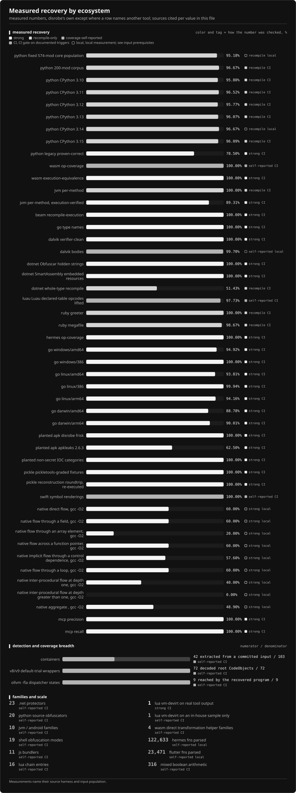

# Deterministic static recovery with `disrobe`

> Decompile, deobfuscate, and unpack compiled software through one evidence-tracked command line.

`disrobe` is a Rust command-line suite for static software recovery. It handles source obfuscation, bytecode, frozen applications, managed assemblies, native binaries, packers, archives, firmware, and compiled webview frontends. The default path never executes the sample. One opt-in PyArmor v6/v7 fallback does execute it and requires `--allow-dynamic`; use that path only inside an isolated sandbox.

> **Try it in your browser: [the `disrobe` playground](https://1-3-7.github.io/disrobe/playground/).** Decompile a `.pyc`, scan a pickle for malicious reduce callables, and summarize a `.wasm` module, all client-side, with the core passes compiled to WebAssembly. Nothing is uploaded.

The live catalog spans <!-- m:catalog_ecosystems -->15<!-- /m --> ecosystems: Python, JavaScript and TypeScript, WebAssembly, JVM and Android, .NET, native PE/ELF/Mach-O/NE, Go, Lua, PHP, Ruby, Erlang and Elixir on BEAM, Swift and Objective-C, ActionScript 3, mobile runtimes, and shell languages. The implemented native-packer tier currently lists <!-- packer-roster:implemented -->Donut, sRDI, UPX, ASPack, Petite, MPRESS, FSG, PECompact, Yoda's Crypter, NSPack, MEW, kkrunchy<!-- /packer-roster -->. Run `disrobe catalog [ecosystem]` for the per-family recovery tier compiled into your binary.

## Guarantees and boundaries

- No model runs in the recovery path. Metadata bundles are deterministic structured data for downstream tools.
- Output ordering and serialization are deterministic. A committed gate hashes three real fixture recoveries across Linux, macOS, Windows, and the batch runner at one and four workers. This evidence does not claim that three fixtures prove every possible input.
- The main CLI ships as one Rust binary. In-house paths launch no external program. Commands with optional backends can invoke installed tools when you select a backend or use that command's `--backend auto` policy.
- The shared artifact layer can store recovered state in a content-addressed `.dr` envelope with an rkyv payload, postcard sidecar, and BLAKE3 root. Chain runs record topology and per-stage provenance separately.
- Python recovery is measured at <!-- m:py_stdlib_full_pct -->95.09%<!-- /m --> per-code-object equivalence on the full CPython 3.14 stdlib (<!-- m:py_stdlib_full_count -->17378 of 18276<!-- /m -->), plus <!-- m:py_stdlib_pinned_pct -->96.59%<!-- /m --> on the pinned 200-module corpus (<!-- m:py_stdlib_pinned_count -->6072 of 6286<!-- /m -->). These figures describe their stated populations, not every Python program.

## Who this is for

- Malware analysts and incident responders who receive a packed, frozen, or obfuscated sample and need to read what it does, without executing it.
- Security researchers auditing a closed binary for interoperability or vulnerability research.
- Developers recovering their own lost source from a shipped `.pyc`, `.jar`, `.dll`, or bundled `.js`.
- Tooling authors who need the Rust crates, typed Python bindings, daemon protocols, metadata bundles, or browser playground.

## Choose the reachable surface

`disrobe auto` can run only the pass IDs registered in that build. `disrobe passes` prints those IDs, their ecosystem, and their support tier. Direct commands expose additional operations that are not auto-chain passes, including recon, taint analysis, optional external decompilers, and `disrobe webview` for Electron, Tauri, and Wails frontend recovery. Use `disrobe --help` for direct commands and `disrobe catalog [ecosystem]` for recognized families.

In-house recovery remains available without optional toolchains. JVM, Android, .NET, and native commands can also use installed tools such as CFR, Vineflower, jadx, ILSpy, de4dot, or Ghidra where their command-specific backend policy allows it. `disrobe doctor` reports what is installed; it does not make an unavailable backend part of an in-house result.

## Measured recovery

Every figure below comes from a committed test gate or a local measurement harness. `strong` figures are graded against an independent oracle; `coverage-self-reported` figures state the inspected population and count disrobe's own output. The full per-value sourcing lives in [`xtask/data/recovery.json`](https://github.com/1-3-7/disrobe/blob/main/xtask/data/recovery.json).

Colour and tag together state how each bar was checked. A lighter bar means a stronger reference
could have rejected the number, a filled mark means a committed gate reproduces it on every run, and
a hollow mark means the input stays outside the tree.

| Ecosystem | Measured | Oracle |
|---|---|---|
| Python bytecode | <!-- m:py_stdlib_full_pct -->95.09%<!-- /m --> per-code-object equivalence on the full CPython 3.14 stdlib (<!-- m:py_stdlib_full_count -->17378 of 18276<!-- /m -->); <!-- m:py_stdlib_pinned_pct -->96.59%<!-- /m --> on the pinned 200-module corpus (<!-- m:py_stdlib_pinned_count -->6072 of 6286<!-- /m -->). Whole-module exact, where a module counts only if all of its code objects pass: 122 of <!-- m:py_stdlib_pinned_modules -->200<!-- /m --> modules on the pinned corpus | recompile on CPython 3.14.5, opcode diff |
| CPython legacy 1.0-3.7 | <!-- m:py_legacy_count -->150 of 191<!-- /m --> proven-correct (CI floor); <!-- m:py_legacy_local_count -->166 of 191<!-- /m --> measured locally | recompile-equivalence or structural token-match |
| WebAssembly | 1034 of 1034 opcodes lowered across the 38 parseable modules (133 of 133 functions), counted against an inventory `wasm-tools` produced rather than one disrobe produced; 57 of 57 execution-eligible functions equivalent | external opcode inventory for coverage, wasmtime differential for execution |
| JVM classfile | <!-- m:jvm_per_method_count -->131 of 131<!-- /m --> methods recompile error-free | real `javac` |
| Android (Dalvik) | <!-- m:dalvik_verifier_pct -->100%<!-- /m --> of the verifier-presented classes in the committed dex corpus pass the JVM verifier (<!-- m:dalvik_verifier_count -->118 of 118<!-- /m -->). A further <!-- m:dalvik_link_skipped_count -->37 of 155<!-- /m --> classes are link-skipped and never reach the verifier, because they reference supertypes the harness does not bundle, so those are ungraded rather than passing | `-Xverify:all` over assembled jar |
| Ruby YARV | greeter <!-- m:ruby_greeter_pct -->100%<!-- /m -->, megafile <!-- m:ruby_megafile_pct -->98.67%<!-- /m --> opcode-multiset equivalence | recompile on MRI |
| PyArmor | <!-- m:pyarmor_frac -->72 / 72<!-- /m --> manifest-named v8/v9 default-trial wrappers decrypt and decode one complete header-anchored root `CodeObject` | self-reported structural check; no source, emitted `.pyc`, semantic, execution, or external comparison |
| Containers | <!-- m:containers_formats -->101<!-- /m --> formats declared with an in-tree extractor, <!-- roster-breadth:containers-exercised -->41<!-- /roster-breadth --> of them driven to member bytes by a committed input | extraction over the committed corpus, pinned per format |

The numbers that are not perfect are labeled `SEMANTIC`, `PARTIAL`, or `SKELETON`. Native-virtualized code, runtime-only keys, and RSA-wrapped capsule keys remain detect-only when the required information is absent from the input.

## Refusal is a result

`disrobe` refuses to emit a recovery it cannot justify from the input. A refusal names its reason and is a normal, expected outcome, not a failure of the run.

The rule behind it: a wrong recovery costs more than no recovery. A reader who receives output assumes it describes the input, so output that merely looks plausible is worse than a refusal that says what was missing. Two consequences follow, and both are deliberate.

Evidence that is only probable does not become a result. Where several readings of the same bytes are equally consistent with the input, `disrobe` reports the ambiguity instead of choosing the likeliest one. A native function compiled to a single return instruction, for example, cannot be distinguished from several different source signatures on its own bytes, so it is refused unless a caller in the same object proves which one applies.

A refusal is scoped to the evidence, not to the problem. "Not recoverable from this input" is a claim about the bytes supplied; a wider input set can reopen it. A key that exists solely at run time is reported as a static-recovery limit.

## Where to start

- First run: [Installation](./installation.md), then [Quickstart](./quickstart.md).
- The design: [Architecture overview](./architecture.md), then [the five-rung IR ladder](./ir-ladder.md).
- One language: its [language guide](./languages/python.md).
- The full family list: the [supported families catalog](./catalog.md), or `disrobe catalog [ecosystem]`.
- Triage of stripped code or recovered source: [queryable IR and capabilities](./query.md) and [recon, prowl, and indicators](./frisk.md).
- Embedding: [Use it as a library](./library.md), or [the browser playground](./playground.md) first.
- An exact command or flag: the [CLI command reference](./cli/reference.md).
- Untrusted samples: [Forensics and malware-safety posture](./forensics-safety.md), before anything else.
