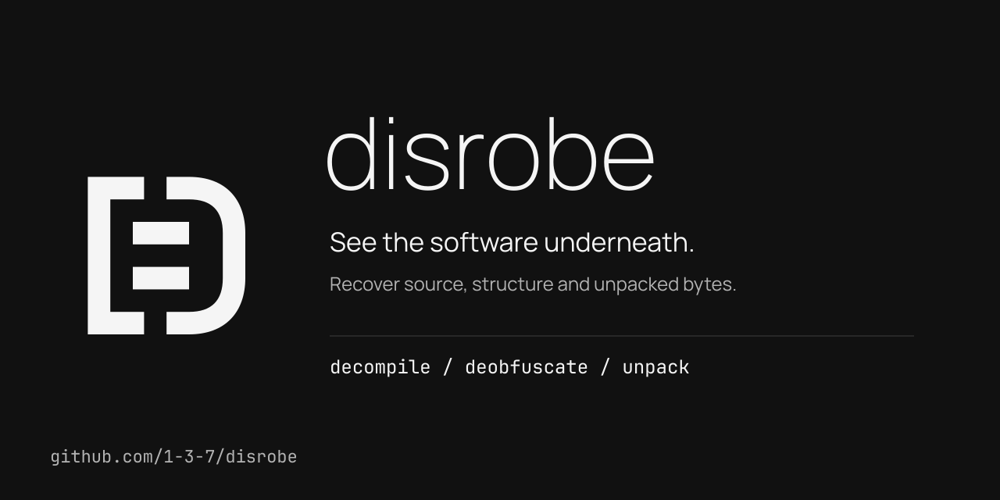

# `disrobe`: a universal decompiler, deobfuscator, and unpacker

> One tool to decompile, deobfuscate, and unpack almost anything, deterministically, in a single Rust binary.

**disrobe** is a universal multi-language decompiler and deobfuscator. It decompiles Python `.pyc` bytecode, unpacks PyArmor and PyInstaller, reads Nuitka-compiled binaries, decompiles WebAssembly, deobfuscates JavaScript, decompiles .NET / CIL and JVM / Java, recovers Android DEX, and unwraps native PE / ELF / Mach-O packers, all from one static binary built for malware analysis and reverse engineering.

> **Try it in your browser: [the `disrobe` playground](https://1-3-7.github.io/disrobe/playground/).** Decompile a `.pyc`, scan a pickle for malicious reduce callables, and summarize a `.wasm` module, all client-side, with the core passes compiled to WebAssembly. Nothing is uploaded.

**disrobe** reverses the bytecode, packers, freezers, and protectors layered onto compiled and frozen software across 20+ ecosystems: Python, JavaScript/TypeScript, WebAssembly, JVM and Android, .NET, native PE/ELF/Mach-O, Go, Lua, PHP, Ruby, Erlang/Elixir (BEAM), Swift/Objective-C, ActionScript 3, React Native Hermes, Flutter Dart AOT, and the native packer tier layered on top of them (UPX, MPRESS, NSPack, FSG, kkrunchy, MEW, ASPack, PECompact, Petite, Yoda's Crypter). It ships as a single static Rust binary.

Built for forensic and recovery work where reproducibility matters:

- **Deterministic.** No model anywhere in the decompile path. The same input produces byte-identical output on every machine and every run, usable as evidence and as a diff baseline.
- **Single static binary.** No JVM, no Python runtime, no Docker image required to run the core. Builds from one `cargo build --release`. Drops into CI headlessly.
- **Content-addressed.** Every recovered artifact persists as a `.dr` envelope: an rkyv hot payload plus a postcard cold sidecar, rooted by a BLAKE3 hash. Cache hits are byte-identical and chains compose offline.
- **Honest.** Every Python decompile is recompiled on the matching interpreter and compared opcode-for-opcode: <!-- m:py_stdlib_full_pct -->92.43%<!-- /m --> per-code-object equivalence on the full CPython 3.14 stdlib (16880 of 18262), plus <!-- m:py_stdlib_pinned_pct -->95.85%<!-- /m --> on the pinned 200-module corpus (5920 of 6286). Recovery that is not perfect is labelled `SEMANTIC`, `PARTIAL`, or `SKELETON` rather than presented as ground truth. Commercial-tier packers that **disrobe** cannot fully unpack are reported as detect-only by design, never faked.

## Who this is for

- **Malware analysts and incident responders** who receive a packed, frozen, or obfuscated sample and need to read what it does, without executing it.
- **Security researchers** auditing a closed binary for interoperability or vulnerability research.
- **Developers** recovering their own lost source from a shipped `.pyc`, `.jar`, `.dll`, or bundled `.js`.
- **Review tooling.** Every pass can emit a structured metadata sidecar (`--metadata-pack-4`, with `--llm` kept as a compatibility alias) carrying the call graph, type signatures, control-flow shape, capability surface, and decompile provenance. The sidecar is deterministic data for downstream tooling, not a model-backed decompiler.

## What makes it different

**disrobe** ships passes for every ecosystem above from a single binary. Where mature FOSS already exists (CFR, Vineflower, jadx, ILSpy, JPEXS, unluac, hermes-dec, Ghidra), **disrobe** wraps it headlessly behind a unified CLI and adds chain auto-detection, deterministic `.dr` envelopes, and round-trip verification. Where FOSS coverage is thin (PyArmor v9-pro, the native packer tier, Hermes against a live bundle, Flutter Dart AOT, MicroPython `.mpy`, PEP 750 t-strings), it is among the few tools handling these statically and offline. Where the field is dominant (Ghidra/IDA/Binary Ninja for native decompilation), **disrobe** is the unpack, symbol-recovery, and chain-detect layer that feeds them cleaner input.

## Measured recovery

Every figure below is produced by a committed test gate or a local measurement harness graded against an independent oracle, never the tool's own output. The full per-value sourcing lives in [`xtask/data/recovery.json`](https://github.com/1-3-7/disrobe/blob/main/xtask/data/recovery.json).

| Ecosystem | Measured | Oracle |
|---|---|---|
| Python bytecode | <!-- m:py_stdlib_full_pct -->92.43%<!-- /m --> per-code-object equivalence on the full CPython 3.14 stdlib (16880 of 18262); <!-- m:py_stdlib_pinned_pct -->95.85%<!-- /m --> on the pinned 200-module corpus (5920 of 6286) | recompile on CPython 3.14.5, opcode diff |
| CPython legacy 1.0-3.7 | 150 of 191 proven-correct (CI floor); 166 of 191 measured locally | recompile-equivalence or structural token-match |
| WebAssembly | 98.4% op-coverage on the 36 parseable corpus modules (124 of 126); 50 of 50 execution-eligible functions equivalent | execution differential under wasmtime |
| JVM classfile | 131 of 131 methods recompile error-free | real `javac` |
| Android (Dalvik) | <!-- m:dalvik_verifier_pct -->99%<!-- /m --> of verifiable classes pass the JVM verifier (102 of 103) | `-Xverify:all` over assembled jar |
| Ruby YARV | greeter <!-- m:ruby_greeter_pct -->100%<!-- /m -->, megafile <!-- m:ruby_megafile_pct -->98%<!-- /m --> opcode-multiset equivalence | recompile on MRI |
| PyArmor | <!-- m:pyarmor_samples -->72<!-- /m --> of 72 real-corpus samples recovered | plaintext-absent oracle |
| Containers | <!-- m:containers_formats -->98<!-- /m --> formats detected, <!-- m:containers_formats -->98<!-- /m --> extracted in-tree | per-format byte length |

The numbers that are not perfect are labelled `SEMANTIC`, `PARTIAL`, or `SKELETON`, and the information-theoretic walls (native-virtualized code, runtime-only keys, RSA-wrapped capsule keys) are reported as detect-only by design.

## How to read these docs

- New here? Start with [Installation](./installation.md) and [Quickstart](./quickstart.md).
- Want to understand the design? Read the [Architecture overview](./architecture.md), then [the five-rung IR ladder](./ir-ladder.md).
- Looking for a specific language? Jump to its [language guide](./languages/python.md).
- Want the full family list? See the [supported families catalog](./catalog.md), or run `disrobe catalog [ecosystem]`.
- Triaging stripped code or recovered source? See [queryable IR and capabilities](./query.md) and [recon, prowl, and indicators](./frisk.md).
- Embedding it? See [Use it as a library](./library.md), or try [the browser playground](./playground.md) first.
- Need an exact command or flag? See the [CLI command reference](./cli/reference.md).
- Running **disrobe** against untrusted samples? Read [Forensics and malware-safety posture](./forensics-safety.md) first.
