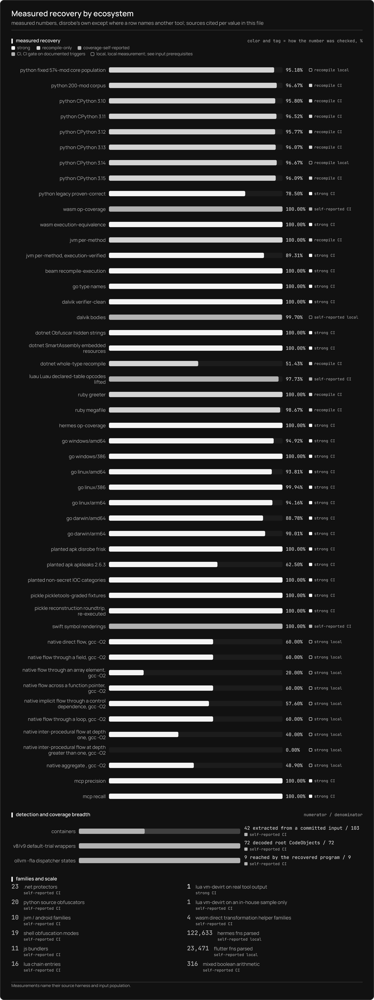

# disrobe: static software recovery

Decompile, deobfuscate, and unpack compiled software from one command line.

`disrobe` is a Rust command-line suite for static software recovery. It handles source obfuscation, bytecode, frozen applications, managed assemblies, native binaries, packers, archives, firmware, and compiled webview frontends. The default path never executes the sample. One opt-in PyArmor v6/v7 fallback does execute it and requires `--allow-dynamic`; use that path only inside an isolated sandbox.

<video controls playsinline preload="metadata" poster="./assets/walkthrough/poster.png" aria-label="Disrobe recovery walkthrough" class="walkthrough-video">
  <source src="./assets/walkthrough/walkthrough.mp4" type="video/mp4">
  <track kind="captions" src="./assets/walkthrough/captions.vtt" srclang="en" label="English" default>
  <track kind="chapters" src="./assets/walkthrough/chapters.vtt" srclang="en" label="Chapters">
  <a href="./assets/walkthrough/walkthrough.mp4">Watch the Disrobe walkthrough</a>
</video>

[Watch or download the full video](./assets/walkthrough/walkthrough.mp4) · [Read the transcript](./assets/walkthrough/transcript.txt). Six CLI commands show native unpacking, indicator extraction, automatic recovery, Lua decompilation, and recovered WebAssembly instructions in 36 seconds.

> **Try it in your browser: [the `disrobe` playground](https://1-3-7.github.io/disrobe/playground/).** Decompile a `.pyc`, scan a pickle for malicious reduce callables, and summarize a `.wasm` module, all client-side, with the core passes compiled to WebAssembly. Nothing is uploaded.

The live catalog spans <!-- m:catalog_ecosystems -->15<!-- /m --> ecosystems: Python, JavaScript and TypeScript, WebAssembly, JVM and Android, .NET, native PE/ELF/Mach-O/NE, Go, Lua, PHP, Ruby, Erlang and Elixir on BEAM, Swift and Objective-C, ActionScript 3, mobile runtimes, and shell languages. The implemented native-packer tier currently lists <!-- packer-roster:implemented -->Donut, sRDI, UPX, ASPack, Petite, MPRESS, FSG, PECompact, Yoda's Crypter, NSPack, MEW, kkrunchy<!-- /packer-roster -->. Run `disrobe catalog [ecosystem]` for the per-family recovery tier compiled into your binary.

## Guarantees and boundaries

- No model runs in the recovery path. Metadata bundles are deterministic structured data for downstream tools.
- Output ordering and serialization are checked by hashing three fixture recoveries across Linux, macOS, Windows, and batch runs with one and four workers.
- The main CLI ships as one Rust binary. In-house paths launch no external program. Commands with optional backends can invoke installed tools when you select a backend or use that command's `--backend auto` policy.
- The shared artifact layer can store recovered state in a content-addressed `.dr` envelope with an rkyv payload, postcard sidecar, and BLAKE3 root. Chain runs record topology and per-stage provenance separately.
- Python's normalized opcode-structure agreement is <!-- m:py_stdlib_full_pct -->95.18%<!-- /m --> on a fixed 574-module CPython 3.14 core population (<!-- m:py_stdlib_full_count -->17396 of 18276<!-- /m --> code objects), excluding `idlelib` and `turtledemo`. Its pinned 200-module subset reaches <!-- m:py_stdlib_pinned_pct -->96.67%<!-- /m --> (<!-- m:py_stdlib_pinned_count -->6077 of 6286<!-- /m -->). See the [comparison rules](./languages/python.md#measured-opcode-structure).

## Who this is for

- Malware analysts and incident responders who receive a packed, frozen, or obfuscated sample and need to read what it does, without executing it.
- Security researchers auditing a closed binary for interoperability or vulnerability research.
- Developers recovering their own lost source from a shipped `.pyc`, `.jar`, `.dll`, or bundled `.js`.
- Tooling authors who need the Rust crates, typed Python bindings, daemon protocols, metadata bundles, or browser playground.

## Choose the reachable surface

`disrobe passes` lists the automatic recovery routes included in the current build, with their ecosystems and support tiers. Direct commands also provide recon, taint analysis and optional external decompilers. Electron and Tauri frontends use `webview.carve`; Wails can use Go's embedded-filesystem route. Use `disrobe --help` for commands and `disrobe catalog [ecosystem]` for recognized families.

In-house recovery remains available without optional toolchains. JVM, Android, .NET, and native commands can also use installed tools such as CFR, Vineflower, jadx, ILSpy, de4dot, or Ghidra where their command-specific backend policy allows it. `disrobe doctor` reports what is installed; it does not make an unavailable backend part of an in-house result.

## Measured recovery

Every figure below comes from a committed test gate or a local measurement harness. `strong` figures are graded against an independent oracle; `coverage-self-reported` figures state the inspected population and count disrobe's own output. The full per-value sourcing lives in [`xtask/data/recovery.json`](https://github.com/1-3-7/disrobe/blob/main/xtask/data/recovery.json).

[Open the full-size recovery chart](./assets/recovery.png).

Colour identifies the comparison method. A filled mark denotes a CI gate on its documented
triggers; a hollow mark denotes a local measurement. Each descriptor lists its inputs and prerequisites.

| Ecosystem | Measured | Oracle |
|---|---|---|
| Python bytecode | Normalized opcode-structure agreement: <!-- m:py_stdlib_full_pct -->95.18%<!-- /m --> across the fixed 574-module core population (<!-- m:py_stdlib_full_count -->17396 of 18276<!-- /m -->); <!-- m:py_stdlib_pinned_pct -->96.67%<!-- /m --> on the pinned corpus (<!-- m:py_stdlib_pinned_count -->6077 of 6286<!-- /m -->). Whole-module agreement, where every compared code object matches: 124 of <!-- m:py_stdlib_pinned_modules -->200<!-- /m --> modules | CPython 3.14.5 compilation and normalized opcode comparison; jump targets and most operands are excluded |
| CPython legacy 1.0-3.7 | <!-- m:py_legacy_count -->150 of 191<!-- /m --> regression threshold | Recompiled bytecode or structural token comparison |
| WebAssembly | 1034 of 1034 opcodes lowered across the 38 parseable modules (133 of 133 functions), counted against an inventory `wasm-tools` produced rather than one disrobe produced; 57 of 57 execution-eligible functions equivalent | external opcode inventory for coverage, wasmtime differential for execution |
| JVM classfile | <!-- m:jvm_per_method_count -->131 of 131<!-- /m --> methods recompile error-free | real `javac` |
| Android (Dalvik) | <!-- m:dalvik_verifier_pct -->100%<!-- /m --> of the verifier-presented classes in the committed dex corpus pass the JVM verifier (<!-- m:dalvik_verifier_count -->118 of 118<!-- /m -->). A further <!-- m:dalvik_link_skipped_count -->37 of 155<!-- /m --> classes are link-skipped and never reach the verifier, because they reference supertypes the harness does not bundle, so those are ungraded rather than passing | `-Xverify:all` over assembled jar |
| Ruby YARV | greeter <!-- m:ruby_greeter_pct -->100%<!-- /m -->, megafile <!-- m:ruby_megafile_pct -->98.67%<!-- /m --> original opcode-name multiset recall | recompile on MRI; ordering, operands and additional opcodes are excluded from this score |
| PyArmor | <!-- m:pyarmor_frac -->72 / 72<!-- /m --> manifest-named v8/v9 default-trial wrappers decrypt and decode one complete header-anchored root `CodeObject` | self-reported structural check; no source, emitted `.pyc`, semantic, execution, or external comparison |
| Containers | <!-- m:containers_formats -->103<!-- /m --> formats detected, including a bounded raw-volume-key LUKS1 route; <!-- roster-breadth:containers-exercised -->42<!-- /roster-breadth --> generic routes are driven to member bytes by a committed input | extraction over the committed corpus, pinned per format; tracked LUKS1 plaintext comparison |

Recovery reports include support tiers and per-stage outcomes. Native-virtualized code, runtime-only keys, and RSA-wrapped capsule keys remain detect-only when the required information is absent from the input.

## Recovery limits

An unsupported instruction, ambiguous signature, or unavailable runtime key can stop a recovery
stage. Its report names the reason and retains the recovered structure available up to that point.
Supplying additional artifacts, such as a matching runtime or name map, can make another recovery
path available. See [reading a result](./reading-a-result.md) for outcomes and error codes.

## Where to start

- First run: [Installation](./installation.md), then [Quickstart](./quickstart.md).
- The design: [Architecture overview](./architecture.md), then [the five-rung IR ladder](./ir-ladder.md).
- One language: its [language guide](./languages/python.md).
- The full family list: the [supported families catalog](./catalog.md), or `disrobe catalog [ecosystem]`.
- Triage of stripped code or recovered source: [queryable IR and capabilities](./query.md) and [recon, prowl, and indicators](./frisk.md).
- Embedding: [Use it as a library](./library.md), or [the browser playground](./playground.md) first.
- An exact command or flag: the [CLI command reference](./cli/reference.md).
- Untrusted samples: [Forensics and malware-safety posture](./forensics-safety.md), before anything else.
